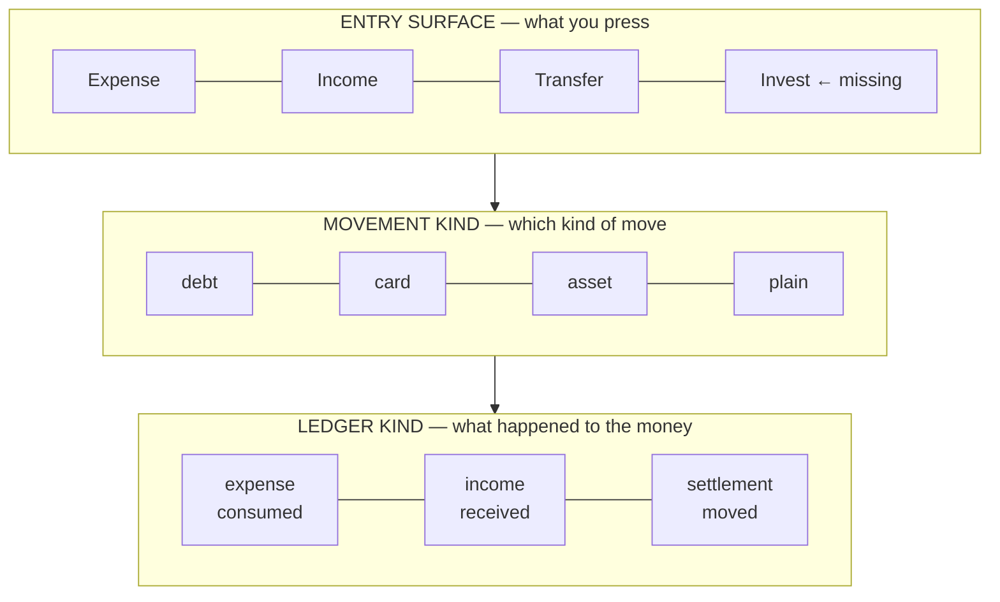
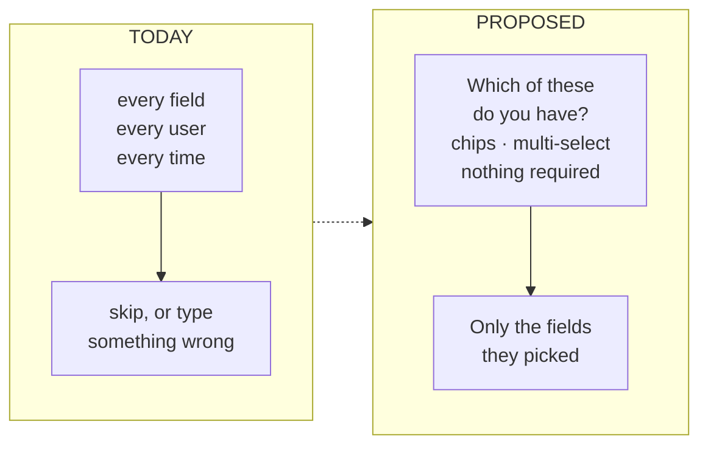
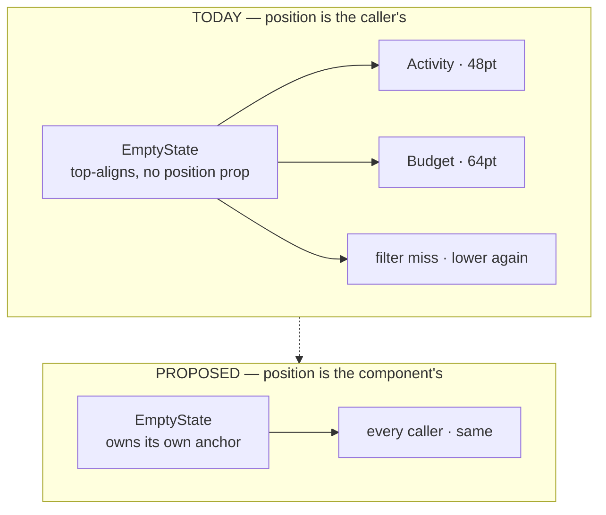

# WALK-01 — the cold sweep

**A wiped app, walked from first run through every empty state. 2026-09-04.**

`Sweep: 1 · Cold (empty)` · 45 notes · 17 broken · 16 fine · 1 noted
`Raw answers: docs/history/WALK-01-raw.md`

Two more were raised while this was being written up — asset restatement history and the filter
surfaces — and both are here, because a walk's findings do not stop arriving the moment the walk
does.

---

## §0 · What this is, and when it dies

This is a **walk record**, not a live document. `SYSTEM.md` says what the app is; this says what one
person saw when they opened it with no data in it, what turned out to be true underneath, and what
to do about it.

**Superseded when:** every row in §6 is closed or has been folded into `SYSTEM.md` as an `OV-`,
`DQ-` or `FE-`. At that point this file moves to `docs/history/` unchanged. Until then it is the
only place the walk's conclusions live.

Six findings are already filed and can be cited from anywhere: `OV-28` · `OV-29` · `OV-30` ·
`OV-31` · `OV-32` · `OV-33`, plus `DQ-24` · `DQ-25` · `DQ-26` · `DQ-27`. Everything else carries a
local `W1-nn` id, because most of it is a plain defect with a known line and does not need a
namespace.

**Every claim below was traced to source.** The notes are what was *seen*; the tables say what is
*true*. Where those differ, the difference is the finding — and it differed six times.

---

## §1 · The conclusion, in one page

The cold sweep is the only sweep that can see first run and empty states, and it found three
different classes of thing.

**One systemic problem.** Empty states had no vertical anchor and four different renderings, so
moving between two tabs of the same screen moved the illustration. This was the walk's opening note
and the only finding in it that is not local — `OV-32`, ✅ **fixed 2026-09-04**. The anchor is opt-in,
because the obvious version of it collapses ~30 call sites to zero height, and it is now held by
`emptyState.test.ts` rather than by anyone remembering.

**Six notes that named the wrong defect.** This is the most valuable part of the walk, and the
reason walking beats reading. In every case something real was seen and the cause was elsewhere:

| Seen | Actually |
|---|---|
| "The income I entered never became a recurring transaction" | It did — `onboarding.ts:95-110`, covered by `finalizeOnboarding.test.ts`. A rule is `recur_freq IS NOT NULL`, which `IV-04` excludes from every ledger, and it surfaces only on `SC-32` behind the Plan tab header. **It exists nowhere you looked.** |
| "I skipped people and the summary still asked me to make a group" | The summary is innocent; its group row is gated `people.length > 0`. The prompt is **on Home afterwards**, keyed on `flags.splitting` alone, which never consults whether you skipped. |
| "The forecast graph was removed" | It is there, gated on `dayOfMonth >= 3` **and** `spentSoFar > 0`. When either fails the whole section **vanishes with no placeholder and no reason**. |
| "A yellow warning appears with zero transactions" | `SampleNote` turns amber below five transactions with **no zero guard**, printing *"Based on 0 transactions logged this month"*. |
| "Review doesn't appear when there's nothing to review" | The empty state was built and is **unreachable** — both entry points require rows. `OV-31`. |
| "I can't remove Sanvika even though we're settled" | The refusal is **referential, never net**: merely being in a group blocks removal, while the message says *"you've shared expenses with them"* — false in exactly that case. `DQ-25`. |

**One idea worth generalising.** From the income step, and it is not about onboarding:

> *"A question before every sensible input screen — like Income, what assets do you currently have —
> and the next screen has exactly those fields which he selected. Adding complexity when required."*

That is **pick-then-fill**, and §3 writes it up as a pattern.

**And the headline, which reads backwards from how it was written.** The note said *"I lost Invest"*.
Nobody lost it: the model is correct, `transferToAsset` has been writing it correctly all along, and
`OV-20` already counts five names for it. What was missing was a **button** — the Add screen detected
that you were investing and then sent you somewhere else to do it. ✅ **Fixed 2026-09-05** (`OV-30`):
Invest is a fourth pill, saving through the write path that already existed.

**What the walk did not find** is worth stating too. No money was wrong. Every note is about a
surface, a label, a position or a missing entry point; not one of them is a figure that came out
incorrect. The invariants held.

---

## §2 · The money model

Three notes (`SC-04`, `SC-10`, `SC-25`) are one question asked from three places, and it deserves a
straight answer rather than a park.

### 2.1 Is Invest an Expense, a Transfer, or its own thing?

**In the ledger it is a Transfer. On the Add screen it is its own button.** Those are two different
layers, and collapsing them is what made the concept feel lost.

Investing is a movement, not consumption: cash becomes an asset and net worth does not change. That
is settled — `AGENTS.md` §12 states it, `IV-14` enforces the derived half, and `transferToAsset`
already writes both sides in one transaction. So the model was never wrong. Only the surface was.

The app conflates three layers that need separate names:



| Layer | Answers | Lives in | Status |
|---|---|---|---|
| Ledger kind | Consumed, received or moved? | `txn.kind` | Correct |
| Movement kind | *Which* move? | `txn.asset_id` today; `OV-02` proposes `settle_kind` | Works, unnamed |
| Entry surface | What does the user press? | `ADD_KIND` | **Missing a case** |

**The recommendation: a fourth pill, and no schema change.**

```ts
// What the user presses.
type EntryKind = 'expense' | 'income' | 'transfer' | 'invest';

// What is stored. UNCHANGED — no migration, no new column.
type TxnKind = 'expense' | 'income' | 'settlement';

const STORED: Record<EntryKind, TxnKind> = {
  expense:  'expense',
  income:   'income',
  transfer: 'settlement',
  invest:   'settlement',   // + asset_id, which is what already tells them apart
};
```

Invest is a pre-scoped entry into the **existing** `transferToAsset` path with the destination fixed
to the asset register. `asset_id` already separates it from a debt settlement, so this lands **in
front of** `OV-02` rather than waiting on it — and it is what makes `OV-02` worth doing at all.
The *"you may have meant an asset, go to /assets"* banner is deleted, not kept: a banner that
catches a mistake the screen could have prevented is a workaround, not a feature.

**Where each kind counts** — extending `AGENTS.md` §12's table with the new column. If these two
ever disagree, `AGENTS.md` is the one to fix:

| Surface | expense | income | transfer | **invest** |
|---|---|---|---|---|
| Analysis — budgets, breakdowns, spend pace, the Reports donut | counted | counted, separately | **excluded** | **excluded** — nothing was consumed |
| Ledger — lists, `SC-23`, the expanded month | shown | shown | shown | **shown** |
| Cash (`lib/cash.ts`) | lowers | raises | moves both ways | **lowers cash, raises assets — net worth flat** |
| Net worth (`E-54`) | lowers | raises | flat | **flat** |
| Budget | capped | — | — | **see 2.2 — currently invisible** |

### 2.2 What Budget counts → `DQ-26`

`SC-10`'s note: *"all payments are not expenses… should we even consider that in Budget? I think we
should."*

**Yes, and as its own line.** `IV-17` already forbids one total across kinds, so folding an SIP into
a spend figure is not available. But leaving it out means the budget answers *"what did I consume"*
while saying nothing about *"what did I commit"* — and a plan that silently omits ₹10,000 a month is
not a plan.

The shape that satisfies both: **spending is capped, investing is committed, and they are two lines
that never add up into one number.** Filed as `DQ-26` because the layout is yours to pick, not mine.

`SC-10`'s other asks are layout and are offered rather than decided in §7.

### 2.3 Expendable vs asset-growth income → `DQ-24`

*"We should have expendable income as a tag — all income is growth of an asset, not always
expendable."* Made precise: a reinvested dividend or interest capitalised into an FD raises net
worth without raising what you can spend. `lib/safeToSpend.ts` cannot tell either from salary, so it
overstates by exactly the reinvested amount, silently.

The two readers that must agree are `safeToSpend` and `CASH_TOTALS_SQL`. This is not free — the
landing bucket is `INCOME_LANDING`, a view over `PAY_METHOD`, so there is no account for income to
land *in*, which is `DQ-14`. Filed as `DQ-24`, entangled, with the default stated.

### 2.4 Restating an asset → `OV-33` and `DQ-27`

Raised while this section was being written: *can we update an asset's value manually, from time to
time?*

**You already can** — `restateAssetBalance`, reached from `SC-42` — and the function is deliberately
right about the hard part: it writes **no** transaction, because nothing moved between your pockets
and booking one would make cash move for a gain that never touched a bank.

But two source comments say the opposite. `schema.ts:207-209` and `assets.ts:117-118` both promise a
row that explains the change; the function's own docblock correctly says there isn't one. The audit
log has no asset entity either. So a restatement is invisible in **both** places a person would
look, and the source contradicts itself about it in three places — `OV-33`, comments only, fix now.

The feature underneath is real and separate: `asset.balance` is one overwritten number, so there is
no way to see what something was worth last month, chart it, or tell a market move from a typo —
while net worth moves each time. That is `DQ-27`. The cheap shape, if it is wanted:

```ts
// One row per restatement. Append-only; the asset keeps its current balance.
type AssetValuation = {
  id:        string;
  asset_id:  string;
  balance:   number;   // paise, the value AS OF `at`
  at:        number;   // Date.now()
  source:    'manual' | 'transfer';
};
```

That makes a sparkline possible, makes a typo correctable, and costs one table. It is not in any
phase below, because it is a decision first.

---

## §3 · Onboarding

Seven of nine steps came back broken. Most are small; one is a pattern.

### 3.1 Pick-then-fill



Every data-collecting step splits in two: a chip multi-select, then a form containing only what was
chosen. It applies cleanly to **income** (paid monthly? weekly? irregular? not yet?), **money**
(which of these do you have — bank, cash, wallet, credit card, investments?) and **people**. It does
not apply to `name` or `intent`, which are single questions already.

The gain is not fewer taps — it is that **an unasked question cannot be answered wrong**. Today the
money step shows four figures to everyone, and someone with no credit card either types a zero or
skips the whole screen including the parts that did apply.

### 3.2 The nine steps

| # | Step | Note | Traced |
|---|---|---|---|
| 1 | hero | *"name and tag come way before the animation is near complete"* | `W1-01` — the text is on three fixed `FadeIn` delays (1400/1550/1700 ms) while the mark finishes assembling at roughly 4.2 s. A comment elsewhere claims a third set of numbers. ⛔ The animation itself is untouchable (`AGENTS.md` §11) — this is **when the text is revealed**, nothing else. |
| 2 | intent | fine — *"but features/design should adjust based on intent"* | Already true in part: the persona patches only the flags it deviates on. `W1-02`, an ask for more, not a defect. |
| 3 | name | *"field is under the keyboard, basically centre of screen"* | `W1-03` — there is no `KeyboardAvoidingView` by design; the shared step shell centres its body with `flexGrow: 1`, and the keyboard adjusts only the inset. Centring is what puts the field behind it. |
| 4 | income | *"'when do you get paid' should be a simple date selector, recurring options collapsed, skip if not monthly"* | `W1-04` — payday is seven option chips. Also the **pick-then-fill** note above. |
| 5 | money | *"why is there a 'how do you pay most with' section, and there are not all the options"* | `OV-29` — it is asked **twice**, one screen apart, with 7 options then 5. Plus `W1-05`: the horizontally-scrolling selector sits 16pt from the footer with no trailing line, which is what reads as cut off. |
| 6 | pay | fine — *"need other ways if possible, and better colour-deterministic icons"* | `W1-06`, layout. |
| 7 | budget | *"income-based suggestion is fine if they gave income, otherwise blank"* | `W1-07` — already conditional (50/60/70% of income, else flat presets). The ask is that the flat presets be **blank** instead. A layout call. |
| 8 | people | *"don't offer group creation here — just add people you generally transact with; name and email if they want to link a real user"* | `W1-08` — group creation **is** offered here, and the step collects **name only**. `person` already has `email`, `mobile` and `upi_vpa` columns that nothing in onboarding writes. |
| 9 | permissions + summary | *"remove the Shortcut thing once Siri Intents land; summary should be more sensible; I skipped people and it still asked me to create a group"* | The group re-ask is **on Home**, not the summary — `W1-09`, a plain condition bug. The Shortcut row is `DQ-22`, which already says the apparatus is deletable when App Intents arrive. |

> **Resolved in P5.** The table above is the walk as it was recorded and is left in the tense it was
> written in; §6 carries the status. Seven of the nine steps changed: the hero reveal now derives
> from one constant, the name step's footer rides the keyboard, payday is all 31 days behind an
> income, the money step asks for the optional figures only when you tick them, the budget presets
> go blank without an income, the people step drops group creation and gains an email, and the pay
> method is asked once. `W1-02` and `W1-06` were asks rather than defects and are unchanged.

Plus the flow-level note: **the salary rule is created and shown nowhere** (`W1-10`). Two candidate
fixes, and they are not exclusive — surface active rules on `SC-14`, and/or materialise the first
occurrence so there is a real income row on day one. The second changes numbers, so it is a
decision; the first is not.

> **Neither was needed.** Traced in P5: the rule *is* created, and `/plan/recurring` already lists
> it under "Money in" — the screen's own comment says it was put there because recurring income
> "was invisible everywhere until it first materialized, which made onboarding's income answer look
> like it did nothing". The afford engine reads it too, in preference to the 30-day sum. What was
> actually missing was the **door**: the summary closes by naming "Recurring · Plan", and that
> destination was one unlabelled glyph in a rail of four. Fixed as `OV-16`. Materialising an
> occurrence stays rejected — you have not been paid yet, and `paydayAnchor` anchors forward on
> purpose so the rule cannot back-fill.

And *"income should have a dropdown — additional income, a smaller version of Add Income, but
interactive"* (`W1-11`). That is a second income surface, and it should be weighed against
`OV-08` — `SC-07` already has 24 entry points and 11 params, and the answer to a heavy form is
usually not a second lighter one.

---

## §4 · The empty-state system

`AGENTS.md` §2 specifies the anatomy — icon circle, title, explanation, CTA — and says **nothing
about where it sits**. That is the whole reason they drifted.



The 16pt difference is one word: `paddingHorizontal` on the Activity list versus `padding` on the
budget list. Every group tab uses `padding`, so the personal Activity list is the outlier. The third
height comes from the filter bar rendering above the empty state only when there is data to filter.

Filed as `OV-32`, together with the three sites that re-implement or re-wrap the component.

**Two more that are bugs, not position** — `OV-31`: `SC-20`'s empty branch is unreachable because
its guard counts groups and the seed always makes one, and `SC-19`'s is unreachable because both
ways in require rows.

**The open layout question** is what the anchor should be, and it is yours:

| Option | Reads as | Cost |
|---|---|---|
| **A · Fixed top offset** | A consistent slot under the header, wherever you are | Looks high on a tall empty screen |
| **B · Optically centred in the remaining space** (recommended) | Deliberate, and identical across tabs | Moves if the chrome above it changes height |
| **C · Centred, capped** — centred but never below ~40% of the viewport | B, without sinking on short lists | One more rule to hold |

### The rest of the empty-state notes

| Screen | Note | Verdict |
|---|---|---|
| `SC-22` | *"graph removed — bring it back with a solid and a dashed line"* | `W1-12`. Not removed; gated twice and vanishes silently. **The fix is a placeholder saying why**, not un-gating it — a forecast from under three days of data would be worse than none. Solid-actual / dashed-projected is already the intent; it is not visible because the section is not. |
| `SC-22` | *"a yellow warning that shouldn't come at all at 0 transactions"* | `W1-13`. `SampleNote` has no zero guard. **Plain bug.** |
| `SC-40` | *"needs improving for added data — right now it's not in view"* | `W1-14`. The empty state has no CTA, so there is nothing to press. |
| `SC-38` | *"empty state doesn't exist"* | `W1-15`. It exists and is the only one in the app wrapped in a `Card` — a border around the icon disc, which reads as a broken tile rather than an empty state. Part of `OV-32`. |
| `SC-16` | *"no categories until I spend — could show a top 3"* | `W1-16`, later. Correct as built; the ask is a seeded suggestion. |
| `SC-21` | *"in Reports the groups could be collapsed by default and segregated by group"* | `W1-17`. Group cards are flat and always expanded — no collapse state exists. `SC-22` already uses collapsible sections with one open by default; this is the same pattern applied. |
| `SC-15` · `SC-26a` · `SC-17` · `SC-32` · `SC-33` · `SC-41` · `SC-42` | fine, or "empty doesn't come" | Correct by construction — these are detail routes that cannot be reached without the thing they show. |

---

## §5 · `SC-07`, unpacked

One note, fifteen claims. Classified rather than summarised, because three of them turned out to be
already built and two are bugs on the app's highest-traffic screen.

### Bugs — a known line each

| | Claim | Traced |
|---|---|---|
| `W1-20` | *"Every Month doesn't turn off once opened"* | The repeat sheet re-enables itself: an effect with `enabled` in its dependency list and no guard, so switching off **while the sheet is open** turns it straight back on. The sheet's own comment says the switch is the way back off. It is not. **One-line fix.** |
| `W1-21` | *"in Transfer, why is changing the arrow allowed before both people are selected"* | The direction control has no guard. One tap on an untouched form swaps an empty id with yours, both slots resolve to you, and the form shows *"From and To must be different people"* — an error the user could not have caused. |
| `W1-22` | *"no bottom black screen — broken or reduced"* | The screen never reads safe-area insets; its scroll container ends 16pt from the physical edge on a `fullScreenModal`. This regresses the codebase's own rule — `useContentInset` names *"in Quick Add"* as one of the guessed values it exists to replace. |
| `W1-23` ✅ | *"if I select a date in the calendar it goes back"* | Picking a day calls `onChange` then closes. Correct for a one-shot picker, wrong when you are scanning months. |

### Information architecture — decisions, not fixes

| | Claim | Position |
|---|---|---|
| `OV-28` ✅ | *"Auto Pay is not a how… repeat IS auto pay"* | **Right, and now filed.** Autopay is offered in the picker, folds to `bank` in every money calculation, and carries the `repeat` glyph — while the recurring control on the same screen already has auto/remind. It is a *detected* fact about an imported row, never a chosen one. |
| `W1-24` | *"how is really: through which asset, so we can reduce from it"* | This is `DQ-14` restated from the outside, and it is the better framing. Pay method is a label; an account is a thing with a balance. Parked there. |
| `W1-25` ✅ | *"date and time should be one component, with year and month selectors"* | Time **is** captured and has its own chip and sheet. The ask is to merge two controls into one date-time control and to add a year selector — reaching a date a year back is currently twelve taps. |
| `W1-26` | *"repeat should be last of the three"* | Ordering, in "How & when". Free. |
| `W1-27` ✅ | *"'How was it paid' could be vertical rather than a horizontal scroll"* | Same component the onboarding money step uses — fixing it once fixes both notes. |
| `W1-28` | *"component placement comes and goes in a line/section and sizes change — feels broken"* | The general form of `W1-05` and the empty-state anchor: things that appear conditionally must not move what is already on screen. Worth one rule rather than N fixes. |
| `W1-29` | *"Transfer and Income have a bottom line, others don't"* | Inconsistent divider. Free. |
| `W1-30` | *"the calculator feels too complex"* | It has four operators, a custom keypad, a running total and a remainder warning. No `AC`, no `%`. **Worth asking what to cut before cutting** — the divide-by-N case is the one that earns it. |

### Already built — recorded so they are not built twice

| | Claim | Reality |
|---|---|---|
| `W1-31` | *"tags could be saved for reuse, most-used first"* | Already: the vocabulary is derived from your own rows and ranked by frequency. The real delta is **per-category** ranking. |
| `W1-32` | *"category component's arrow can be incomplete on the right"* | The category chip is a `grow` chip with a chevron — cosmetic, needs a device look. |
| `W1-33` ✅ | *"opening Notes/Tags/Split isn't fast enough — the component goes, then the keyboard"* | Not a slow animation. Opening a sheet dismisses the keyboard first, the modal presents, then the sheet's own field autofocuses while the sheet is still mid-spring — **two uncoordinated keyboard transitions**. Fixable by focusing after the animation rather than at mount. |

---

## §5b · Finding a row again — `OV-34`

*"Filters in Groups are not good. We need better search and filter fields in the group transactions
tab, and in Search."*

Traced, and the shape is worse than the note: **four filter surfaces, three implementations.**

| Surface | Built on | Offers |
|---|---|---|
| `SC-14` Personal | `ui/FilterBar` | kind, free text |
| Group ledger (`SC-09` Expenses tab) | `ui/FilterBar` | kind, free text |
| `SC-23` Search | **its own chip row** | kind, source, free text (tags folded into the haystack) |
| `SC-19` Review | `review/FilterForm` | its own set |

Two things make this worth a `COLLAPSE` rather than a polish:

- **The shared component is itself one of the variants.** `FilterBar` hand-rolls its chips over
  `TouchableOpacity` instead of using `ui/Chip` — the exact rule `AGENTS.md` §9 exists to enforce,
  and the reason there were seven pill variants before it.
- **The weakest filter is on the ledger that needs it most.** A shared group with months of entries
  filters on kind and free text only, in memory, with no date range — which is the single field you
  reach for when you are looking for something in a group.

The fix is one component on `ui/Chip` carrying the union of what is already implemented somewhere,
adopted by all four. No query changes: every one of them already filters in memory.

Beyond parity, the fields the notes actually asked for — **date range**, and **person** on a shared
ledger — are the two that do not exist anywhere yet. Those are additions, and worth deciding on
before the collapse rather than after, so the shared component is designed for them.

---

## §6 · The findings register

Every note from the walk, once. `Filed` names the durable id where one exists.

### From first run

| id | What the note said | What is true | Filed |
|---|---|---|---|
| `W1-01` ✅ | hero text precedes the animation | Delays were 1400/1550/1700 against a mark that forms at ~2850 ms — the text arrived before the physics loop started. One `HERO_REVEAL_MS`, derived and guarded | — |
| `W1-02` | features should adapt to intent | Partly true already; an ask | — |
| `W1-03` ✅ | name field under the keyboard | The footer sat outside the scroll view, so the keyboard covered field *and* CTA. `KeyboardStickyView` + a measured `bottomOffset`; the page still never resizes | — |
| `W1-04` ✅ | payday should be a date, not chips | All 31 days, as `ui/DayOfMonthGrid`. Revealed only once an income is given — the help line promised a salary entry that is written only for `incomeNum > 0` | — |
| `W1-05` ✅ | money step footer reads cut off | Horizontal selector, 16pt to the footer, no trailing line | — |
| `W1-06` | more pay methods, better icons | Layout | — |
| `W1-07` ✅ | budget presets should be blank without income | Blank now. Also deduped: rounding collapsed 50/60/70% into three identical chips on duplicate keys at low incomes | — |
| `W1-08` ✅ | people step shouldn't create groups; want name + email | Group creation deleted (it bypassed `GroupForm`); the step collects name + optional email, and `person.email` finally has a writer | — |
| `W1-09` ✅ | asked to create a group after skipping people | The prompt is on Home, keyed on `flags.splitting` **and** `onboarding_skipped_people` **and** a live group count — not the flag alone. Skipping records the decision, so both tiles stay suppressed. Since `W1-08` removed group creation, the tile now fires for someone who *added* people, which is correct: they have contacts and no group. Skip only records the decision when nothing was added — it doubles as "done here" once there are people, and writing that down as "no thanks" was the opposite of what they did | — |
| `W1-10` ✅ | onboarding income never became a recurring transaction | Not a plumbing gap: the rule is created *and* listed under Plan → Recurring's "Money in". It was invisible because that destination was an unlabelled glyph — fixed as `OV-16` | `OV-16` |
| `W1-11` | want a light "additional income" entry | Weigh against `OV-08` | — |
| — ✅ | onboarding asks pay method twice | Two steps, one state, different sets | `OV-29` |
| — | remove the Siri Shortcut row | Already the plan | `DQ-22` |

### From the empty-state sweep

| id | Screen | Finding | Filed |
|---|---|---|---|
| — | all | Three heights, four renderings | ✅ `OV-32` — done 2026-09-04 |
| — | `SC-20`, `SC-19` | Two empty states nothing can reach | `OV-31` |
| `W1-12` | `SC-22` | Forecast section vanishes with no explanation | — |
| `W1-13` | `SC-22` | Amber sample note has no zero guard | — |
| `W1-14` | `SC-40` | Empty state has no CTA | — |
| `W1-15` | `SC-38` | Only empty state wrapped in a `Card` | ✅ unwrapped |
| `W1-16` | `SC-16` | Could suggest a top 3 before any spend | — |
| `W1-17` | `SC-21` | Reports groups not collapsible | — |
| `W1-18` | `SC-09`, `SC-11`, `SC-13` | Member and group-edit rows read as undesigned | — |
| `W1-19` | `SC-26` | Cannot remove a settled person. Splits in two: `W1-19a` the message, which is simply false when the only reference is group membership, and `W1-19b` the policy, which is a decision | `W1-19a` free · `W1-19b` → `DQ-25` |
| — ✅ | `SC-04` | "I lost Invest" | `OV-30` |
| — | `SC-05` | Assets / investments / in-account flow unclear; Plan feels complex | `OV-30`, `DQ-27` |
| — | `SC-10`, `SC-25` | Not all payments are expenses; expendable-income tag | `DQ-24`, `DQ-26` |
| `W1-34` | `SC-06` | Settings option grouping and clarity | — |
| `W1-35` | `SC-08` | Line-item editing could be cleaner | — |
| `W1-36` | `SC-18` | Colours, view and position could be better | — |
| — | `SC-23`, group ledger | Filters are weak, and no two are the same | `OV-34` |
| `W1-37` | `SC-42` | Needs clearer outline | — |
| `W1-39` | `SC-03`, `SC-15`, `SC-17`, `SC-26a`, `SC-28`, `SC-32`, `SC-33`, `SC-41` | Fine, or correctly no empty state | — |
| — | `SC-35` | Not answered | — |

### From `SC-07`

`W1-20` – `W1-33` and `OV-28`, in §5.

---

## §7 · The plan

Ordered by what blocks what, not by severity.

### Phase 0 · Free — one condition each, nothing to decide ✅ **done 2026-09-04**

Every item had a traced line and no layout consequence.

| | Fix | |
|---|---|---|
| `W1-20` | A `useRef` latch arms the repeat sheet once per open, so switching off stays off | ✅ |
| `W1-21` | The direction control refuses until both people are chosen, and says so to a screen reader instead of offering an action that does nothing | ✅ |
| `W1-22` | Quick Add adopts `useContentInset()`; the guessed `paddingBottom` is gone | ✅ |
| `W1-13` | `SampleNote` returns null at zero — guarded in the component, so every caller gets it | ✅ |
| `W1-09` | Skipping the people step is recorded as an answer (`onboarding_skipped_people`), read through `homeData`, and cleared by Replay welcome tour | ✅ |
| `W1-14` | `/approvals` empty state gained a CTA — it sends you to who you trust, which is what the screen is about | ✅ |
| `W1-19a` | `deletePerson` now returns `via: 'account' \| 'history' \| 'group'`, and `lib/personCopy.ts` says something true for each. The group case deliberately offers no escape, because none exists | ✅ |
| `OV-33` | Both comments corrected; `schema.ts` names `DQ-27` as the open half | ✅ |
| `W1-26` | Repeat moved last in "How & when" — the header had claimed that order all along | ✅ |
| `W1-29` | **Still open.** No divider asymmetry exists in source: `formBlock` is margin-only and `AmountField`'s underline is on every kind. Needs a device look to locate. | ⏳ |

Six new tests came with it — five on `refusalReason`, one on history-beats-group precedence.
`crossSurfaceConsistency.test.ts` was also fixed: it dated its fixture at midday, which is in the
*future* under a pinned clock, so it failed all seven dates of `npm run test:calendar` and nobody
had run it there. It passes all seven now.

### Phase 1 · The empty-state rule

Pick an anchor from §4, put it in `EmptyState`, then the rest is mechanical: the outlier padding,
the three hand-rolls, `OV-31`'s two unreachable states, `W1-14`'s missing CTA. Add the anchoring
rule to `AGENTS.md` §2 in the same change, or it drifts again.

**Gate:** the §4 option.

### Phase 2 · The Add screen

`W1-22` (safe-area inset), `W1-33` (focus after the animation), `W1-23`/`W1-25` (the date-time
control and the year selector), `W1-27` (vertical pay-method selector — which also closes `W1-05`),
`OV-28` (Autopay out of the picker).

**Gate:** `W1-25` and `W1-27` are layout; `W1-22` and `W1-33` are not and can go first.

### Phase 3 · Onboarding

`OV-29` first — it is a deletion. Then pick-then-fill on income, money and people; then `W1-01`,
`W1-03`, `W1-04`, `W1-07`, `W1-08`. `W1-10` last, because surfacing the salary rule is easy and
materialising it changes numbers.

**Gate:** pick-then-fill is a redesign; the individual defects are not and do not have to wait.

### Phase 4 · The Invest pill — `OV-30` ✅ **done 2026-09-05**

Surface only. Adds the fourth entry kind and routes it through `transferToAsset`. Did **not** wait
on `OV-02`.

Two things went differently from the plan. The banner was **repointed rather than deleted** — it now
switches kind in place, keeping the amount already typed, which is strictly better than sending you
to another screen to start again. And "surface only" was optimistic: eight files moved, of which the
compiler caught two. The rest were `switch` defaults, a `===` chain and negated single-kind gates,
all of which compiled and silently did the wrong thing. `addKind.test.ts` is the mechanism that
stops the next kind being half-added.

**Gate:** none. This was the first phase that added a capability rather than repairing one.

### Phase 5 · One filter — `OV-34` ✅ **done 2026-09-05**

Rebuilt `FilterBar` on `ui/Chip`, carried the union of what the four surfaces did, adopted in
`SC-23`, `SC-14` and the group ledger. **Date range and person** were both taken, per §5b.

§5b's table was wrong in two places, and the corrections shaped the work: `SC-14` Personal offered
group scope and **no free text at all** (not "kind, free text"), and **date range was not missing
everywhere** — `SC-19` Review already had a full date+time range, so it was lifted rather than
designed. The bigger half of the fix is not the chips: `lib/txnFilter.ts` means the same word finds
the same row on all three ledgers, which it did not before.

### Phase 6 · Budget and income clarity

`DQ-26` then `DQ-24`. Both need §2's calls made first, and `DQ-24` is entangled with `DQ-14`.

### Parked, with the trigger stated

`DQ-25` (person archiving) · `DQ-27` (valuation history) · `W1-11` (second income surface, weigh
against `OV-08`) · `W1-16`, `W1-30`, `W1-34`–`W1-37` (taste, cheap, no urgency) · `W1-24` → `DQ-14`.

---

## §8 · What the next walk should be

This was sweep 1 of three. Sweep 2 is **demo data** — every populated surface, which is most of the
app and the fastest pass. Sweep 3 is **hands-on**, where the point is watching a number move, and it
is the only sweep that can test what this one could not: that the money is right.

Walk 1 found no wrong figures, but it also could not have. **Nothing in it exercised a write path.**
That is the honest limit of this document.
