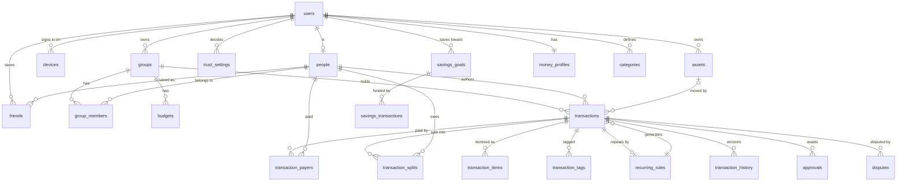

# SPEC-SERVER — your data on a real server, still usable offline

`Status: BUILT (S0–S22), frozen 2026-09-25 · Written 2026-09-24 · Direction: docs/history/SYNC-AUDIT-2026-09.md §7, option B (DQ-93)`

This spec covers one piece of work, the same way `docs/history/SPEC-2026-09-FEEDBACK.md` did, and it is **not** a live doc.
Open decisions get a `DQ-` row in `docs/TRACKER.md` and an entry in `docs/FINDINGS.md`. When this
work lands, its behaviour moves into `docs/SYSTEM.md`, `docs/SCREENS.md` and a rewritten
`docs/SYNC-MODEL.md`, and this file moves to `docs/history/`.

---

## 0 · Objective

**The decision (2026-09-24, `DQ-93`).** Privacy is set aside for now.

- **The server holds all your data.** It keeps a readable, properly modelled copy of everything a
  user has, the way any production web app does.
- **The phone stays offline-first.** SQLite remains the working copy, every screen works with no
  signal, and changes upload when the phone can reach the server.
- **Trust and approvals stay as they are.**
- **iOS is the only client.** The API is shaped so that a browser client could be added later
  without rework.

**What changes for the user:**

1. **Sign in on a new phone and everything is back.** That covers personal spending, budgets,
   goals, assets, groups, friends and settings. This answers `DQ-89`.
2. **A shared group behaves like Splitwise.** Friends see the same group, the same entries and the
   same balances, and removing someone really removes them.
3. **Daily use does not change.** Adding an expense in a lift with no signal works exactly as
   today, and the expense uploads once the phone is back online.
4. **You always know where your data stands.** One quiet status line shows one of: *Offline — saved
   on this phone* · *Syncing 40%* · *Up to date · 2 min ago* · or a failure that says what to do.

**What success looks like:**

- The two-phone test passes (§8).
- After a reinstall and sign-in, every figure matches what it was before, down to the paise.

## 0.1 · Capability map

| Module id | Responsibility | Depends on |
|---|---|---|
| `server-schema` | The server's data model in D1: every entity, relationship, constraint and index (§2) | — |
| `sync-protocol` | Push and pull, scopes, cursors, idempotency and conflicts (§3) | `server-schema` |
| `personal-sync` | Round-trips everything a user owns. Handles the first sign-in: upload, restore or ask (§4) | `sync-protocol` |
| `sync-ux` | The status line, the first-sign-in screens, and the conflict and failure surfaces (§6) | `personal-sync` |
| `shared-groups` | Groups, members, invites, roles, shared transactions, approvals and disputes — all enforced by the server (§5) | `personal-sync` |
| `retire-e2e` | Deletes the crypto, rosters, device keys and old routes, and rewrites the privacy copy (§7) | `shared-groups` |

**Build order:** `server-schema` → `sync-protocol` → `personal-sync` and `sync-ux` → `shared-groups`
→ `retire-e2e`.

There are two device checkpoints:

- **After `personal-sync`:** reinstall the app, sign in, and everything comes back.
- **After `shared-groups`:** the two-phone test.

---

## 1 · Principles

Each of these is a rule, not a preference.

1. **The server is the authority. The phone is a fast working copy that also works offline.** Local
   writes show instantly. If the server refuses one, the phone reverts it and says why. It never
   loses a write silently.
2. **The server enforces every rule that protects one person from another.** That means
   authorship, membership, roles, the money invariants and approvals. Checks in the app become a
   courtesy, which is what the header of `permissions.ts` already asks for.
3. **One computation lives in one place.** The Worker imports the app's pure modules
   (`lib/splitMath`, `lib/permissions`, `lib/trust`) rather than rewriting them. `esbuild` bundles
   relative imports, so when a rule changes, both sides get the change.
4. **Store facts, derive figures.** Balances, cash, net worth and Safe-to-Spend are still derived on
   the phone, by the code that derives them today. The server stores transactions and never a
   computed balance. This is `AGENTS.md` §12–13, unchanged.
5. **Money never uses silent last-write-wins** (`SYNC-F3`).
   - Every write to a transaction, budget, asset, goal or goal ledger is compare-and-set on
     `version`.
   - Names, colours and preferences may use last-write-wins, because a lost rename costs nothing.
6. **Anything that syncs is soft-deleted.** `deleted_at` is a tombstone that the pull delivers. A
   hard delete cannot propagate to other devices.
7. **Removal ends a relationship, never a record** (`SYNC-F11`). Leaving a group, or being
   removed from it, archives the group on your phone. Nothing you spent is deleted.

---

## 2 · `server-schema` — the entities and how they relate

### 2.1 The model at a glance



Read it as sentences:

- A **user** is an account, and each account **is** exactly one **person**.
- A **person** is any human in any ledger. Some have accounts; a flatmate without one is still a
  person.
- A **group** has **members**, who are people.
- A **transaction** belongs to one group. It was written by one person, **paid by** some people and
  **split** between some people.
- **Assets**, **savings goals**, **categories** and the **money profile** belong to one user.

### 2.2 Naming rules

- **Table names are plural snake_case** and say what the thing *is*: `transactions`, not `txn`;
  `groups`, not `budget_group`.
- **Foreign keys are `<singular>_id`**: `group_id`, `person_id`, `transaction_id`, `user_id`,
  `goal_id`. A foreign key with a role in its name says the role: `author_id → people`,
  `owner_id → users`.
- **Booleans are `is_*`.** **Time is `*_at`**, in epoch ms. **Money is integer paise.**
- **Enums are `TEXT` with a `CHECK (… IN (…))`** that mirrors `constants/enums.ts`. A guard test
  compares the two lists (§9).
- **These are the server's names.** The phone keeps its own table names: renaming 22 local tables
  would be pure churn and pure risk. One pure module, `lib/sync/rowMap.ts`, translates between the
  two, and a test fails if any column on either side is unmapped (§2.11).

### 2.3 Every synced table carries these columns

"Synced" means pulled to the phone. `users`, `people`, `devices`, `sync_scopes`, `sync_rejections`,
`write_guard` and `transaction_history` are server bookkeeping and are **not** pulled as tables, so they
carry no `scope_id`/`seq`. A person's two useful facts, their id and whether they have an account,
travel on the `group_members` and `friends` rows that point at them.

| Column | Rule |
|---|---|
| `id` | `TEXT PRIMARY KEY`. A uuid **created on the phone**, so creating something offline needs no round trip. The server checks the format, and refuses an id that already belongs to someone else. |
| `scope_id` | `TEXT NOT NULL REFERENCES sync_scopes(id)`. This is the one thing that decides who may read the row (§3.1). |
| `version` | `INTEGER NOT NULL DEFAULT 1`. The basis for compare-and-set. |
| `seq` | `INTEGER NOT NULL`. The scope's change counter at the row's last write. The pull cursor reads it through the index `(scope_id, seq)`. |
| `created_at`, `updated_at` | Stamped by the **server**. |
| `created_by`, `updated_by` | `→ users`, taken **from the session, never from the request body**, so nobody can write as someone else. |
| `deleted_at` | The tombstone. |
| Amounts | `CHECK (amount > 0)` wherever zero or a negative number means nothing. A balance may be `>= 0`. |
| JSON | `TEXT CHECK (json_valid(…))`. Used only for nested shapes that are never queried: `adjustments`, `split_values`. |

**D1 enforces foreign keys by default**, and the app's local database does not (`DQ-19`). That is
the first way the server model is stricter than the local one.

**Tables that pair two things** (`friends`, `group_members`, `group_preferences`, `approvals`,
`disputes`, `money_profiles`, `user_preferences`) still get their own `id`, with a `UNIQUE` on the
pair. Every synced row then has one key the pull and `rowMap` can use.

**Stricter, never incompatible.** Wherever the phone does not actually guarantee a rule — a goal's
target, the sign of an opening balance, the case of a category name — the server does not invent
one. A constraint the phone can violate turns into an upload that is refused for good.

### 2.4 Accounts and people

| Table | Belongs to | Key columns | Relations and rules |
|---|---|---|---|
| `users` | — | exists (`email`, `name`, `phone`, `avatar_url`, `deleted_at`) | The account. Email stays the identity (`SYNC-F8`, out of scope). |
| `devices` | user | `user_id`, `label`, `last_mutation_id`, `last_seen_at` | One row per install. Its `last_mutation_id` is what makes a retried upload harmless (§3.2). |
| `people` | — | `user_id` (unique, nullable), `merged_into` | **One id per human, everywhere.** An account holder is exactly one person. A friend who has no account is a person with `user_id` NULL. When they sign up and connect, their person is **merged** into the real one, and every reference is repointed in one batch. This replaces the phone-by-phone ids and the `{uid, pid}` double naming (`syncDoc.ts:34-39`). |
| `friends` | user | `user_id`, `person_id`, `name`, `avatar_color`, `mobile`, `email`, `upi_vpa`, `receivable_status`, `is_archived` | **The people *I* have saved, as I see them.** What I call them and their UPI handle are *mine* to decide. Unique on `(user_id, person_id)`. Nobody else can rename my friends. The product word is *Friends* (T12), so the table uses it. |
| `links`, `invites`, `friend_request`, `friend_block` | — | exist | Unchanged. Two accounts being linked is still what allows inviting someone into a group by account. |

### 2.5 Groups

| Table | Belongs to | Key columns | Relations and rules |
|---|---|---|---|
| `groups` | the group itself | `kind` (`personal`/`shared`/`pair`), `name`, `icon`, `color`, `owner_id → users`, `simplify_debts`, `default_split`, `carry_over`, `currency` | `owner_id` can **never change** — a trigger aborts any attempt. The owner is always an admin, so a group can never be left without one (`SYNC-F20`, the "no admin" half of `DQ-33`). **Exactly one `personal` group per user.** A personal group has one member: its owner. A `pair` group has two members, and "the friend this group is" is **not stored** — it depends on who is looking, so each phone derives it as the other member. |
| `group_members` | group | `id`, `group_id → groups`, `person_id → people`, `display_name`, `role` (`admin`/`member`), `status` (`invited`/`active`/`left`/`removed`), `joined_at`, `left_at`, `invited_by → users` Unique on `(group_id, person_id)`; `left_at` is set exactly when `status` is `left`/`removed`. **Being an active member is what grants access** (§3.1). A friend without an account is `active` as soon as they're added. An account holder is `invited` until they accept. |
| `group_preferences` | user | `user_id`, `group_id`, `is_archived`, `sort_order` | Archiving is **my** decision about **my** list, never a fact about the group. |

### 2.6 Categories and budgets

| Table | Belongs to | Key columns | Relations and rules |
|---|---|---|---|
| `categories` | user | `user_id`, `kind`, `name`, `section`, `icon`, `color` | Unique on `(user_id, kind, name)` among rows that are not deleted — **case-sensitive, exactly like the phone**: the server must never refuse a state the phone can produce. A deleted row stays as the tombstone, so reseeding the defaults never brings it back. This replaces `category_tombstone`. |
| `budgets` | group | `group_id → groups`, `category`, `cadence` (`daily`/`monthly`/`yearly`), `amount > 0`, `person_id → people` (NULL = the group's default) | One default per category per group, and one personal override per person per category (two partial unique indexes, as on the phone). The server checks `canEditGroupBudget` for a default and `canSetOverrideFor` for an override. |

A transaction and a budget refer to a category **by name**, not by id. Each user has their own
list of categories, so a shared transaction has to use the one vocabulary every member shares.
Making categories global is `project_global_categories_vision`, and it is out of scope here.

### 2.7 Transactions

A **transaction** is written and read **as one unit**: the row itself, together with its payers,
splits, items, tags and repeat rule, all in one D1 batch. The children never change without their
parent.

| Table | Key columns | Relations and rules |
|---|---|---|
| `transactions` | `group_id → groups`, `kind` (`expense`/`income`/`settlement`), `entry_mode`, `amount`, `date`, `timezone`, `category`, `note`, `pay_method`, `source`, `currency`, `asset_id → assets`, `latitude`, `longitude`, `place_label`, `adjustments`, `recurring_rule_id → recurring_rules`, `occurrence_date`, `author_id → people` | `amount > 0`, and it must **equal both** the sum of payers and the sum of splits, checked on every write with `validateShares`. The **server** sets `author_id` from the session. `income` and `asset_id` are allowed only in a personal group: income is never shared, and what you own is not the group's business. Coordinates are range-checked. |
| `transaction_payers` | `transaction_id`, `person_id`, `amount > 0` | **Who paid**, and how much. Every payer must be an active member of the group. |
| `transaction_splits` | `transaction_id`, `person_id`, `amount > 0` | **Who owes**, and how much. Every person here must also be an active member of the group. |
| `transaction_items` | `transaction_id`, `name`, `quantity > 0`, `unit_price >= 0`, `assigned_to`, `split_mode`, `split_values` | The line items of an itemised bill. |
| `transaction_tags` | `transaction_id`, `tag` | One row per tag, so "everything tagged *Goa*" is an indexed query rather than a JSON search. |
| `recurring_rules` | `transaction_id` (primary key), `frequency`, `interval > 0`, `ends_at`, `status` (`active`/`paused`/`ended`), `mode` (`auto`/`remind`), `paused_at` | **A repeating transaction is a transaction plus one of these rows.** On the phone, seven repeat columns sit NULL on every normal transaction. Here, a rule is simply a row that exists, and its columns can be `NOT NULL`. Each occurrence points back to its rule through `recurring_rule_id`. |
| `recurring_skips` | `rule_id → recurring_rules`, `occurrence_date` | Dates the user skipped. |
| `transaction_history` | `transaction_id`, `version`, `snapshot`, `edited_by → users`, `edited_at` | **Edit history.** The server writes a row on every change. It is loaded on demand for a transaction's History, and it is not part of the pull. Splitwise keeps the same record, and it is what settles a disagreement. |

### 2.8 Approvals, trust and disputes

| Table | Belongs to | Key columns | Who writes it |
|---|---|---|---|
| `approvals` | the user who has to decide | `transaction_id`, `user_id`, `status` (`pending`/`approved`/`rejected`), `is_pending_delete`, `landed_pay_method`, `arrived_at`, `decided_at` | **The server**, when a transaction names another account holder. It runs the same `requiresMyApproval` (`lib/trust.ts:100`) against *that person's* trust settings. After that, only that person can approve, reject or reopen. An approval is private to them, as today. |
| `trust_settings` | user | `user_id`, `person_id`, `group_id` (NULL = everywhere), `level` (`trusted`/`review`) | One row per person, with an optional per-group override. It is always about **a person, never a group** (`IV-10`). This one table replaces `person.trust_state` and `person_group_trust`. |
| `disputes` | group | `group_id`, `transaction_id`, `user_id` (who disputed), `transaction_version`, `raised_at`, `withdrawn_at` | **The server**, when someone rejects a transaction or takes the rejection back. The author sees it. The phone never writes this table directly. |

### 2.9 Personal money

| Table | Key columns | Relations and rules |
|---|---|---|
| `assets` | `user_id`, `name`, `kind` (`investment`/`property`/`gold`/`deposit`/`vehicle`/`other`), `icon`, `color`, `balance >= 0`, `is_archived`, `sort_order` | Money, so compare-and-set. `DQ-27` (value history) stays open. |
| `savings_goals` | `user_id`, `name`, `target >= 0` (the phone doesn't forbid 0), `priority`, `category`, `icon`, `color`, `allocation >= 0`, `frequency`, `is_locked`, `is_archived`, `last_auto_at`, `target_date`, `sort_order` | — |
| `savings_transactions` | `user_id`, `goal_id → savings_goals` (**NOT NULL** — the old pool is gone), `amount > 0`, `kind` (`deposit`/`allocate`/`withdraw`), `source` (`manual`/`auto`), `source_bucket`, `date`, `note` | — |
| `money_profiles` | `user_id` (primary key), `opening_bank`, `opening_cash`, `opening_wallet`, `credit_limit`, `credit_used`, `card_baseline_at` | The `money.*` settings become one typed row. **There is no `investments` column**: that figure is derived from `assets` and must stay derived (`AGENTS.md` §12). |
| `user_preferences` | `user_id`, `key`, `value` | **An allowlist of keys only.** Device state — migration flags, cursors, `app_last_open` — never travels (`SYNC-F7`). Last-write-wins. |
| `imported_transactions` | the columns of `pending_txn` | The Review inbox, so a half-reviewed import survives a new phone. |

### 2.10 Activity and sync bookkeeping

| Table | Key columns | Purpose |
|---|---|---|
| `activity_log` | `scope_id`, `actor_id → users`, `entity`, `entity_id`, `action`, `amount`, `created_at`, `seq` | **The feed**, written **only by the server**, in the same batch as the change it describes. Because the actor is a real column, it can answer "what has Aarav changed?", which is what actually closes `SYNC-F22`. |
| `sync_scopes` | `id` (a user id or a group id), `kind`, `seq` | One change counter per scope. **Ordering comes from a counter, not a clock**, so two writes landing in the same millisecond can't swap order — today's `pullEntries` has that hazard (`index.ts:1778-1783`). |
| `sync_rejections` | `device_id`, `mutation_id`, `code`, `message`, `current` | Each refused or conflicting change, handed back on the next pull so the phone can revert it and say why. |
| `write_guard` | one column, `CONSTRAINT precondition_failed CHECK (0)` | D1 has no interactive transactions. Inside a batch, `INSERT INTO write_guard SELECT 1 WHERE NOT (<condition>)` fails the `CHECK` and **aborts the whole batch** whenever a precondition is false. That is how compare-and-set and permission checks stay atomic with the writes they protect. |

### 2.11 From the phone's tables to the server's

| Phone (unchanged) | Server |
|---|---|
| `person` (+ `trust_state`, `receivable_state`) | `people` + `friends` + `trust_settings` |
| `person_group_trust` | `trust_settings` (with `group_id`) |
| `budget_group` / `group_member` | `groups` / `group_members` (+ `group_preferences` for archive) |
| `txn` | `transactions` (+ `recurring_rules` when the row is a rule) |
| `txn_payment` / `txn_share` | `transaction_payers` / `transaction_splits` |
| `line_item` / `txn.tags` / `recur_skip` | `transaction_items` / `transaction_tags` / `recurring_skips` |
| `txn_approval` / `txn_dispute` | `approvals` / `disputes` |
| `category` + `category_tombstone` / `category_budget` | `categories` / `budgets` |
| `asset` / `savings_goal` / `savings_txn` | `assets` / `savings_goals` / `savings_transactions` |
| `settings` `money.*` / allowlisted keys | `money_profiles` / `user_preferences` |
| `pending_txn` / `audit_log` | `imported_transactions` / `activity_log` |
| `sync_outbox`, `settings` `fix_*`, cursors | never leave the phone |

### 2.12 What deliberately stays off the server

- **Receipt photos.** They need R2, which is blocked (`DQ-85`). The rows sync without them, as
  they do today (`SYNC-F4`). Photos get their own spec later.
- **Derived figures.** Balances, cash, net worth, health and Safe-to-Spend (principle 4).
- **Device state.** Migration flags, cursors, the outbox and UI conveniences.

---

## 3 · `sync-protocol`

### 3.1 Scopes and access

Every synced row belongs to exactly **one scope**:

- A **user scope** can be read only by that user.
- A **group scope** can be read by every member whose `group_members.status = 'active'`.

**One function decides access**, the way `approvedMember` does today. That way no route can forget
to check `status = 'active'` or `deleted_at IS NULL`.

### 3.2 Push — `POST /v2/sync/push`

```jsonc
{ "deviceId": "…", "mutations": [
  { "id": 41, "entity": "transactions", "op": "upsert", "entityId": "…", "baseVersion": 3, "data": { /* the whole transaction */ } },
  { "id": 42, "entity": "savings_goals", "op": "delete", "entityId": "…", "baseVersion": 1 }
]}
```

Mutations are applied **in order**. For each one, the server:

1. **Skips it if it was already applied** (`id <= devices.last_mutation_id`).
2. **Checks permission**, using the shared `permissions.ts`:
   - Scope access.
   - Authorship: only a transaction's author may send a new version of it. This closes
     `SYNC-F15`.
   - Role: admin-only actions read the server's `group_members.role`. This closes `SYNC-F24`.
3. **Validates**, using the shared pure modules:
   - The amounts balance (`validateShares`) and are positive.
   - Every person named is an active member of the group.
   - Enum values are valid.
   - Income and assets appear only in a personal group.
4. **Writes one batch** containing:
   - the `write_guard` for `version = baseVersion` on money;
   - the rows themselves, at `version + 1`;
   - `seq + 1` on the scope, stamped onto every row it touches;
   - the `activity_log` row;
   - the `transaction_history` row;
   - the recipients' `approvals`;
   - `devices.last_mutation_id = id`.
5. **Records any refusal or conflict** as a `sync_rejections` row and still advances
   `last_mutation_id`, so a mutation can never retry forever.

**Settled while building (S5–S7):**
- **Derived ids.** Rows with a natural key take a derived id: the money profile is the user id, a preference is `user:key`, a friend is `user:person`, a group preference is `user:group`, a trust setting is `user:person:group|*`.
- **An account's person id is `user:<id>`,** so a phone can compute its own id.
- **Friends without accounts.** A friend who has no account is created as a placeholder person on first reference.
- **Preferences are an allowlist:** `budget_target`, `preferred_upi_app`, `onboarding_intent`, `currency`, `save_location`.
- **Transactions stay in personal groups until S19**, because approvals must exist first.
- **A transaction never moves between groups.** Moving one is a delete plus a create.

The push response only confirms receipt. **The result is read on the pull.** Replicache works the
same way, and it means there is one code path for an outcome, not two.

Limits: 100 mutations per request, 64 KB per transaction, and a per-user write budget.

### 3.3 Pull — `POST /v2/sync/pull`

```jsonc
// request
{ "deviceId": "…", "cursors": { "<userId>": 1180, "<groupId>": 402 } }
// response
{ "scopes": [ { "id": "<groupId>", "kind": "group", "seq": 431,
               "rows": { "transactions": [ … ], "group_members": [ … ] }, "more": false } ],
  "revoked": [ "<groupId>" ], "lastMutationId": 42,
  "rejections": [ { "mutationId": 42, "code": "conflict", "current": { … } } ] }
```

- **A group you just joined starts at cursor 0**, so its whole history arrives through the normal
  pull. There is no special first-sync path.
- **Groups you left, were removed from, or that were deleted come back in `revoked`.** The phone
  archives them and stops syncing them. Nothing is deleted.
- **One page is one consistent snapshot**, because it is read in a single D1 batch. A page holds at
  most 500 rows per scope. When `more` is true, the phone asks again straight away.

### 3.4 What changes on the phone

- **The outbox covers every kind of entity**, not only transactions. It holds
  `(mutation_id, entity, entity_id, scope_id)`. It is still **written in the same local transaction
  as the change it records**, and five edits to one expense still collapse into one mutation.
- **The cycle is push, then pull, then clear.** An outbox row is removed once the pull's
  `lastMutationId` covers it. A rejection resets that entity to the server's copy and raises a
  notice (§6.3).
- **The pull never overwrites something with a change still waiting to upload.** The local change
  wins until the server has answered it.
- **Every money query stays exactly as it is.** `NOT_AWAITING_APPROVAL`, `CASH_TOTALS_SQL`,
  `myShareOf` and the rest are untouched. Approvals now arrive from the server instead of being
  decided by `ingestPeerTxn`, which is why `crossSurfaceConsistency.test.ts` is the test that must
  still pass.
- **When sync runs:** at launch, when the app comes to the foreground, and 2 seconds after a local
  change, so a friend sees a new expense within seconds while the app is open. Push notifications
  are out of scope (`DQ-80`).

---

## 4 · `personal-sync` — the first sign-in

| Phone | Account | What happens |
|---|---|---|
| Has data | Empty | **Upload.** *"Saving your data to your account"*, with a percentage bar. It runs in the background, and the app stays usable while it does. |
| New, reached through *I have an account* | Has data | **Restore.** *"Bringing back your data"*, with a percentage bar, then **Home**. Onboarding is skipped, because the account already holds its answers. |
| Has data | Has data | **Ask**, on one sheet: **"Use my account"** (this phone's data is exported to a file first, then replaced) or **"Not now"** (sign out, nothing changes). Merging is not offered in v1 (`DQ-94`). |

**Each case is atomic.** If one fails partway, the phone is left exactly as it was, never half
migrated.

**Linking the phone to the account replaces `claimMyAccount` and `bindDeviceToAccount`.** The
phone's `is_me` person takes on the account's person id, and every local reference to it is
repointed in **one local transaction**. That repointing is the riskiest step in the whole plan, so
it gets its own task and its own preservation tests (`AGENTS.md` rule 2).

### 4.1 Signing out (`DQ-97`)

The server holds everything, so a signed-out phone keeps nothing. Signing back in, on this phone or
another, brings the whole app back through the **Restore** case above.

| This phone | What sign-out does |
|---|---|
| Linked to this account, and nothing waiting to upload | Runs one sync, then **empties the phone** and returns to Welcome. |
| Linked, with changes that haven't uploaded (offline, a failed push) | **Warns first:** *"3 changes haven't uploaded yet. Signing out now removes them from this phone."* **Cancel** (the default), or **Sign out anyway** — which writes an export file first, then empties the phone. |
| Never linked (the first sign-in was answered **Not now**, or never finished) | Signs out and **keeps everything**: this data exists nowhere else. |

- **"Empty" means a fresh install:** every table in `BACKUP_TABLES`, the sync queue, versions,
  cursors and `sync2.*` settings are cleared, a new `is_me` is seeded, and onboarding is reset to
  Welcome. App preferences in AsyncStorage (flags, reminders, pay method) are cleared too, because
  the next person to sign in may not be the same person.
- **The wipe is one exclusive transaction** (the same shape as `restoreAllTables`), guarded by
  `restoreGuard` so foreground maintenance can't write into it. It either finishes or leaves the
  phone as it was, and the session is cleared only **after** it finishes.
- **The sync must actually finish:** "nothing waiting" is checked after the sync, not before.
- **Until S19,** a shared-group transaction stays queued (`SHARED_TRANSACTIONS_ENABLED`), so it
  counts as waiting and the warning will name it. That is correct: it is not on the server.
- **Delete account doesn't change.** The server copy goes, so the phone keeps its data.
- **The copy changes.** *"Your data stays on this device"* on the sign-out confirm becomes
  *"Everything is saved to your account. Signing out clears this phone; sign in again to bring it
  back."*

---

## 5 · `shared-groups`

| Flow | Today | After this |
|---|---|---|
| **Invite** | The key is wrapped; only the app checks the admin rule (`SYNC-F24`) | The person is added to `group_members` as `invited`. **The server checks the admin rule.** |
| **Accept** | `joinSyncGroup` | Their status becomes `active`, and the next pull brings the group's whole history. |
| **Add a friend with no account** | Travels in the roster, under two ids | A new person plus an `active` member row. If they later sign up and connect, the two are **merged**. |
| **Add or edit a transaction** | Encrypted; any member can overwrite it (`SYNC-F15`) | The server sets the author, and **only the author** can edit. |
| **Approve or reject** | Decided on the device; the dispute travels separately | The server creates the approval and records the decision. A rejection becomes a `disputes` row the author sees. |
| **Remove a member** | Only on this phone (`SYNC-F16`) | A server call that only an **admin** can make, and it can never remove the owner. The removed person's app lists the group under `revoked` from then on. |
| **Leave** | The roster is published first, then the server is told | One server call. The group becomes `revoked` for you. |
| **Delete a group** | Owner-only tombstone | Unchanged: owner-only, and delivered to everyone as `revoked`. |
| **Roles** | Inside the encrypted roster, "a claim, not a fact" (`SYNC-F19`) | A **fact on the server**. Only an admin or the owner can change one, and the owner's role never changes. |
| **No admin left** (`SYNC-F20`) | Can't be repaired | Can't happen: the owner is permanent and always counts as an admin. |
| **Key rotation** (`SYNC-F17`) | Never happens | **No longer applies**: there is no group key. |

`adoptGroup`, `RosterDoc`, `toPeerEnvelope`, `personResolver` and the identity half of
`ingestPeerTxn` all go away. Rows now arrive under ids that are the same everywhere. The trust
decision in `ingestPeerTxn` is not lost: it **moves to the server**, which runs the same pure
function.

---

## 6 · `sync-ux` — the new screens and states

All of it follows `AGENTS.md`:

- one hero per screen;
- `Card`, `ListRow`, `EmptyState` and `PrimaryButton`;
- tokens only;
- 44 pt touch targets;
- Reduce Motion respected.

The research (see Sources) agrees on the rest:

- **Update the screen at once and sync quietly** behind it.
- **Offline is a neutral state, not an error.**
- **Show when the data was last synced.**
- **Show a percentage for long syncs**, never a spinner that doesn't say how long.
- **Make every error say what to do next.** Never "Something went wrong".
- **Don't alarm and don't nag.**

**Layout is your call** (`feedback_numbers_vs_layout`). Every new screen below gets layout options
first, with no code, in task `S-UX1` — the way T13 did for New Group.

### 6.1 The sync status line

This is one component, `SyncStatus`, used everywhere sync state is shown.

| State | Wording | Tone |
|---|---|---|
| Offline | *Offline — saved on this phone. It'll upload when you're back online.* | neutral |
| Syncing | *Syncing · 40%* | neutral |
| Up to date | *Up to date · 2 min ago* | quiet |
| Waiting | *3 changes waiting to upload* | neutral |
| Failed | *Couldn't sync — you're signed out. **Sign in*** | `expense` colour; the fix is part of the line |

It appears in Settings → Account and on the Sync screen. It **does not go on Home**: Home already
has three status surfaces (`A-01`).

### 6.2 First sign-in

The upload, restore and ask screens (§4) are each:

- a hero title;
- a percentage bar;
- one sentence;
- one `PrimaryButton` where there is a choice.

The restore can't be cancelled halfway, because it is atomic and short.

### 6.3 A change that was refused, or that clashed

- **Refused.** For example, you were removed from the group. A `Banner` on the transaction says
  *"This wasn't saved: you're no longer in Goa Trip,"* and the transaction goes back to how it was.
- **Clashed on money.** Someone edited the same transaction first. The transaction shows **both
  versions side by side** and asks *"Keep yours or theirs?"*
  - It never blends the two (principle 5).
  - It also appears in the existing Review inbox, so there is no new list to find.

### 6.4 A transaction's History

A `ListRow` stack on the transaction screen, such as *"Aarav changed ₹400 → ₹450 · 2 Sep"*. It
comes from `transaction_history` and loads when opened.

---

## 7 · `retire-e2e`

- **Delete:**
  - `lib/groupCrypto.ts` and `lib/deviceKey.ts`;
  - the wraps, and the roster and `PersonRef` code in `syncDoc.ts`;
  - the `/sync/*` v1 routes;
  - **server-side passphrase backup**, because the server now *is* the backup.

  Local file export and app lock keep their passphrase.
- **Delete v1's tables from `0001_schema.sql` directly:** `device_key`, `sync_group`, `sync_member`,
  `sync_wrap`, `sync_entry`, `sync_dispute` and `backups`. Development phase — one schema file,
  edited in place, reapplied; no second migration file.
- **Rewrite what becomes untrue** (`SPEC-2026-09-FEEDBACK.md` §3 lists these):
  - the hero tagline;
  - the backup wording;
  - `SYNC-MODEL.md`;
  - the egress table in `SYSTEM.md` §1;
  - the store and privacy answers (`B-08`, `B-13`).

  `B-09` (India DPDP) becomes real the moment a second person signs in.

---

## 8 · Success criteria

- [ ] **Every table in §2 exists, with its relations and constraints.** A schema test proves that
      the foreign keys, `CHECK`s and unique indexes **refuse bad rows**, not just accept good ones.
- [ ] **The push holds up.** An upload sent twice has the effect of one. A stale money write is
      refused and reported. A write without permission is refused and reported.
- [ ] **A reinstall restores everything.** Reinstall, sign in, and every `crossSurfaceConsistency`
      figure matches to the paise.
- [ ] **No half-finished first sign-in.** Each of the three cases leaves the phone either fully
      moved over or untouched.
- [ ] **Two phones, two accounts, one group.** All of these hold:
  - An expense added on A appears on B.
  - "I paid you" waits for B to approve.
  - B's rejection shows on A.
  - Removing B stops B's sync for that group.
  - B cannot edit A's transaction, even by calling the API directly.
- [ ] **The sync findings are closed.** `SYNC-F15`, `F16`, `F17`, `F20`, `F22` and `F24` are each
      closed in the tracker, with the test that proves it.
- [ ] **Everything is green:** `npx jest`, `npx tsc --noEmit`, and `npm run typecheck` in
      `server/api/`.

## 9 · Testing

- **Server logic is tested in Jest,** under `budgetsplit/src/__tests__/server/`.
  - The tests run against the **real migrations**, loaded into `node:sqlite` with foreign keys on.
  - A thin adapter gives D1's `prepare`/`bind`/`batch` over it, the same idea as
    `helpers/testDb.ts`.
  - A batch that throws must roll back, so the adapter wraps each batch in `BEGIN`/`ROLLBACK`.
- **Guard tests:**
  - Every server enum matches `constants/enums.ts`.
  - Every synced table has the §2.3 columns and a `(scope_id, seq)` index.
  - Every route goes through the one access function.
  - `rowMap.ts` maps every column on both sides.
  - No server file re-implements `validateShares` or `requiresMyApproval`.
- **Every regression test is proven by reverting its fix and watching it fail** (`AGENTS.md`).
- **The device checks and the two-phone test are yours.** I report the gates and list the risks.

## Commands

```
App tests:       cd budgetsplit && npx jest
Server tests:    cd budgetsplit && npx jest src/__tests__/server
Typecheck app:   cd budgetsplit && npx tsc --noEmit
Typecheck API:   cd server/api && npm run typecheck
Local D1:        cd server/api && npm run migrate:local && npm run dev
Remote migrate:  cd server/api && npm run migrate        # yours to run
Deploy:          cd server/api && npm run deploy          # yours to run
```

## Project structure

```
server/api/migrations/0001_schema.sql      the whole schema, one file — v1 (§1) and v2 (§2)
server/api/v2/                            access.ts · push.ts · pull.ts · guard.ts · entities/*.ts
budgetsplit/src/lib/sync/                 pure: rowMap.ts (phone ⇄ server), mutation building
budgetsplit/src/db/queries/syncApply.ts   applying a pull + the first-sign-in repointing (SQL stays in db/queries)
budgetsplit/src/components/system/SyncStatus.tsx
budgetsplit/src/__tests__/server/         schema · push · pull · access · idempotency · first sign-in
```

## Boundaries

- **Always:**
  - integer paise;
  - one D1 batch per mutation;
  - the server sets the author and every timestamp;
  - every query goes through the access function;
  - reuse the shared pure modules, never copy them;
  - write the outbox row in the same local transaction as the change;
  - update the tests with the change.
- **Ask first:**
  - running `migrate` or `deploy` against the remote D1;
  - moving to Workers Paid;
  - any new dependency;
  - the layout of every new screen (show options);
  - deleting a test.
- **Never:**
  - store a computed balance on the server;
  - use last-write-wins on money;
  - trust an author, a user id or a timestamp sent by the phone;
  - touch `LogoAssembly.tsx` or the hero;
  - commit secrets;
  - push under the company GitHub account.

## Open questions (the default applies if you don't answer)

| # | Question | Default |
|---|---|---|
| `DQ-94` | Both the phone and the account have data at first sign-in: should the app offer to merge them? | No. v1 offers **"Use my account"** (export this phone's data first) or **"Not now"**. |
| `DQ-95` | Since 2026-09-01, D1 Free **stops working** past 100,000 rows written per day, and index writes count toward that. Moving an existing ledger costs roughly 20 rows per transaction, so two or three people uploading on the same day could hit the cap. Switch to Workers Paid ($5/month) before the pilot? | Stay on Free while developing, and move to Paid before the first person who isn't you signs in. |
| `DQ-96` | Should a group member be able to edit someone else's transaction, as Splitwise allows? | No. Only the author can edit, as today (`AGENTS.md` §13). Approve or reject is how you answer someone else's transaction. |
| `DQ-97` | What does signing out do to this phone's data? | Sync first, then empty the phone (§4.1). Unsent changes → a warning, and an export file before anything is deleted. A phone never linked to the account keeps its data. |

## Sources

- Replicache — push/pull, `lastMutationID`, applying effects atomically: https://doc.replicache.dev/reference/server-push · https://doc.replicache.dev/concepts/how-it-works
- WatermelonDB — what a sync backend must guarantee: https://watermelondb.dev/docs/Sync/Backend
- Cloudflare D1 — foreign keys on by default: https://developers.cloudflare.com/d1/sql-api/foreign-keys/ · a batch is one transaction: https://developers.cloudflare.com/d1/worker-api/d1-database/
- Cloudflare D1 — limits, and index writes counting as rows: https://developers.cloudflare.com/d1/platform/pricing/ · enforced from 2026-09-01: https://developers.cloudflare.com/changelog/post/2026-09-01-d1-free-tier-limit-enforcement/
- Offline and sync design guidance: https://developers.google.com/open-health-stack/design/offline-sync-guideline · https://leancode.co/blog/offline-mobile-app-design
- Splitwise — friends without accounts, activity, edit history, who can edit: https://feedback.splitwise.com/knowledgebase/articles/89944-why-can-other-people-edit-or-delete-expenses-that · https://feedback.splitwise.com/forums/162446-general/suggestions/14739627-dummy-users-for-simplified-splitting
