# UX Audit

**Scope:** genuine interaction/usability quality — distinct from `docs/DEBT_TRACKER.md`'s 🎨 UI/UX section (consistency/correctness debt, fully closed as of 2026-07-28). This audit judges the *rendered* app against `AGENTS.md`'s own design rules plus general usability heuristics, not against external mockups (none exist in this repo).

**Method:** driven live in an iOS Simulator (iPhone 17, iOS 26.5) via Expo dev client, seeded with the full demo dataset (`loadDemoData`). Navigation between screens used Expo Router deep links (`budgetsplit://...`, cold-started to skip the "Open in App?" confirmation); once on a screen, real taps/scrolls/typed text were driven via `cliclick` against the Simulator window (verified working: a tap that switches tabs, a scroll that reveals previously-hidden content, and character-by-character typing into text fields). Tier 1's screens were captured before real-tap tooling was set up and reflect default-mount states only (their findings note this); Tier 2 onward, and a return pass on Home's scroll, used full real interaction — multi-step wizards walked end-to-end, forms actually typed into, sheets/pickers actually opened. Any finding that might be a testing-methodology artifact rather than a real app bug is explicitly flagged as such inline.

**Completed:** 2026-07-31. Screenshots live alongside this doc in `screenshots/<tier>/`. Full inventory covered: Tier 0 (onboarding) through Tier 4 (optional/power-user modules), ~30 screens total.

---

## Tier 1 — Core daily flows

### Home / Dashboard

**What's good:**
- One clear hero number (Spent this month) with a progress ring showing % of budget — matches AGENTS.md §1 (one hero element per screen).
- "vs last month" delta and a colored budget bar give instant context without extra taps.
- Owe/owed block + inline "Settle" CTA right where a user would look for it.
- Category breakdown shows top 3 + "+14 more categories" — good progressive disclosure.

**Friction found:**
- **Measured, not just eyeballed**: the inbox/search/bell icon circles are exactly **36×36pt** (108px at 3x) with only **8pt** gaps between them, pixel-measured from the screenshot — under AGENTS.md §6's 44×44pt minimum touch target. The avatar circle is larger (44pt) and meets the minimum. Visual size isn't the same as hit-slop, so this may already be mitigated by `hitSlop={10}` per AGENTS.md §6 — but three adjacent 36pt circles 8pt apart leaves very little room for hit-slop to expand without the targets overlapping each other. Worth confirming `hitSlop` is actually applied here.
- Budget bar shows "1x budget" / "2 over" in red — a fully-red overspent bar reads as alarming but there's no obvious next action from Home itself (no "why" or "adjust budget" link right there); user has to know to go to Plan/Budget.
- ~~"Month-end forecast" section is cut off~~ **Retracted after real-scroll test**: scrolling down reveals a well-built forecast card (projected month-end total, over/under-budget delta, ₹/day burn rate vs. budget, "biggest shift vs last month" category callout, "See all insights" link). Not a bug — it's simply below the fold, which is normal.

### Groups list
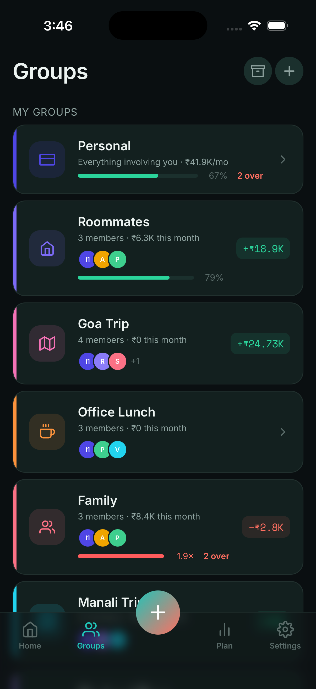

**What's good:**
- Rich per-card summary (members, this-month spend, net amount, progress bar) means you rarely need to open a group just to check status.
- Color-coded left border per group is a nice at-a-glance category cue.

**Friction found:**
- **Inconsistent affordance**: "Personal" and "Office Lunch" cards show a trailing `›` chevron; "Roommates," "Goa Trip," and "Family" don't, despite (presumably) all rows being equally tappable. A user could reasonably conclude only the chevron rows are tappable.
- Net-amount pill coloring: green pill for "you're owed" (Roommates +₹18.9K, Goa Trip +₹24.73K) but a plain dark pill with red text for "Family" (-₹2.8K) — the visual weight of "over budget" (red bar + "2 over") and "you owe" (red text) on the same card uses the same color for two different meanings (budget overrun vs. debt direction), which could blur together at a glance.

### Group hub (Expenses tab) — "Roommates"
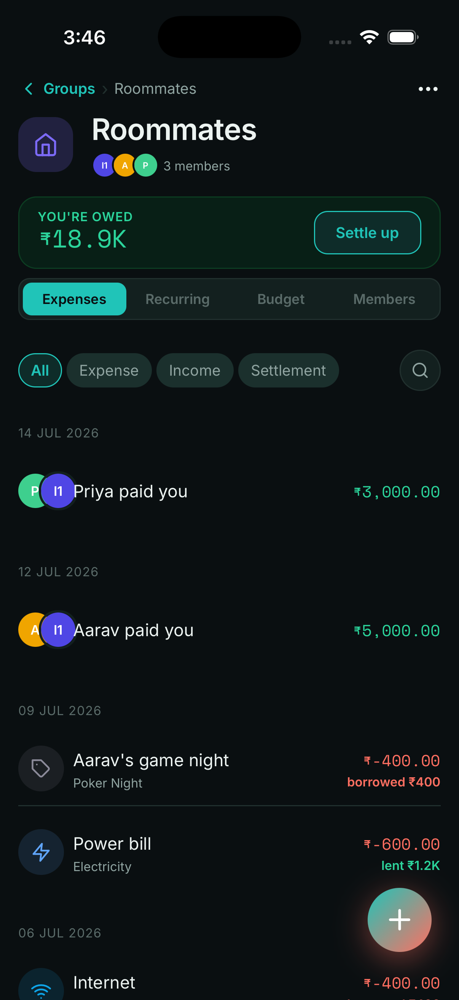

**What's good:**
- Clear "YOU'RE OWED" hero + inline Settle CTA at the top, consistent with Home's owe/owed treatment.
- Filter chips (All/Expense/Income/Settlement) + search are well within reach without a separate screen.
- Per-row secondary annotation ("borrowed ₹400", "lent ₹1.2K") is a nice touch that answers "why this amount" without opening detail.

**Friction found:**
- **FAB overlap**: the floating "+" add button sits directly on top of list content at the bottom of the screen — in the screenshot it visually overlaps the "Power bill" row's "lent ₹1.2K" annotation and is about to cover the next date section. No bottom padding/inset appears reserved for the FAB on this list. Worth checking whether this list's `contentInset`/`contentContainerStyle` accounts for FAB height + tab bar height.
- "Aarav's game night" shows category "Poker Night" with a generic tag icon — this is the seeded "category not in your personal catalog" edge case; worth confirming this reads clearly as an actual category name rather than looking like a placeholder/broken icon to a real user.

### Quick Add (expense)
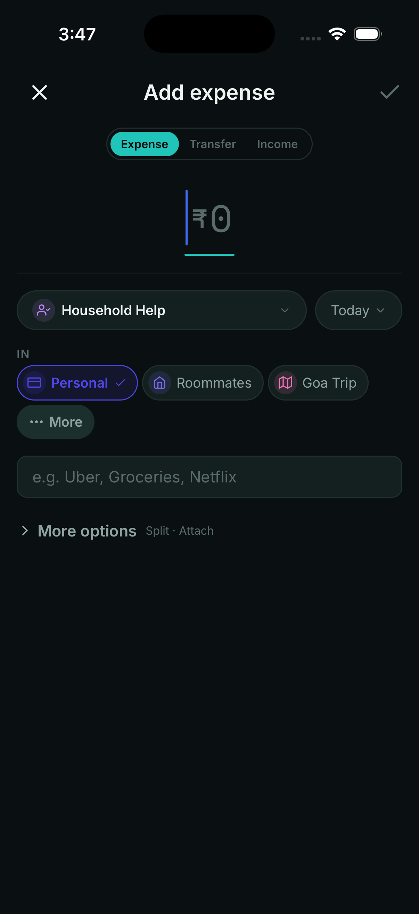

**What's good:**
- Kind toggle (Expense/Transfer/Income) + amount + category + date + group chips + note, all above the fold — matches the "minimum friction" project convention (fast-select chips, smart defaults).
- Group chips ("In: Personal / Roommates / Goa Trip / More") let you pick the group without leaving the sheet.

**Friction found / needs re-verification with real taps:**
- Category defaulted to "Household Help" with no transaction data entered yet — unclear what drives this default; if it's "last used category" that's reasonable, but worth confirming it isn't just the first item in some list.
- **Caveat, not a confirmed bug**: roughly the bottom half of the screen is empty — no numeric keypad is visible under the amount field. This is very likely because deep-linking into this route doesn't auto-focus the amount input the way a real tap-to-open would, so the custom keypad never mounts. Needs a real-tap re-check before treating as a finding.

### Plan tab
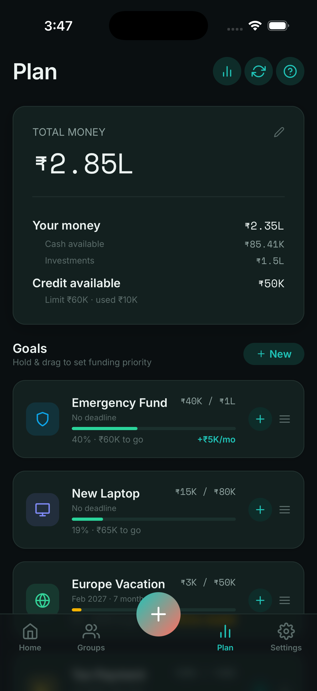

**What's good:**
- "Total Money" hero broken into Your money (cash + investments) / Credit available — answers "how much do I actually have" in one glance, per the money-flow architecture.
- Goals list shows progress bar, %, amount-to-go, and monthly contribution rate per goal — dense but well-organized; drag handle (☰) for reprioritizing is discoverable via the "Hold & drag to set funding priority" hint text.

**Friction found:**
- **Same FAB-overlap pattern as Group hub**: the "+" FAB overlaps the bottom goal card ("Europe Vacation"), obscuring its progress bar. This is now a *second* screen showing the same issue, suggesting it's a systemic FAB/list-padding gap rather than one-off.

---

## Tier 2 — frequent secondary flows (in progress)

### Itemized wizard (`add/itemized.tsx`) — full 4-step flow walked live
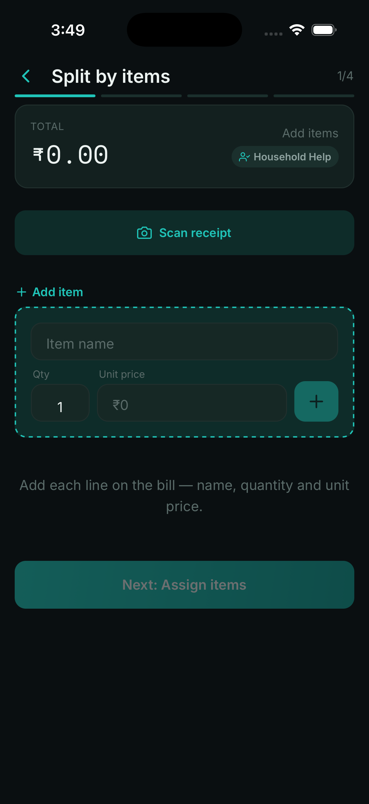 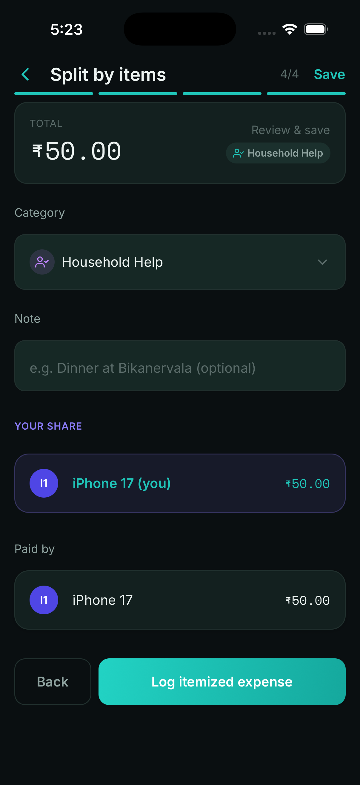

**Scenarios tested:** typed a real item (name "Milk", qty 1, unit price ₹50), watched Line Items/Subtotal/Adjustments appear dynamically, used "Split ₹50.00 equally" quick-fix, entered a payer amount, reached step 4 (Review & save) with all values carried through correctly.

**What's good:**
- Excellent progressive disclosure: Line Items/Subtotal/Total/Adjustments (Tax/Tip/Service/Discount) only appear once the first item is added — the empty-state screen isn't cluttered with sections that have nothing in them yet.
- The "+" add-item button visibly changes to bright teal only when the row is valid (name + price present) — a clear, low-effort readiness signal.
- Real-time validation guardrails: step 2 won't let you proceed with unassigned amount (shows "₹50.00 not assigned to anyone" + a one-tap "Split ₹50.00 equally" fix); step 3 shows live "Balanced"/remaining-amount feedback as you type payer amounts. Both block Next/Review until resolved — good error prevention over error messages.
- Step 4 (Review & save) cleanly surfaces category, note, "YOUR SHARE" (highlighted), and "Paid by" before the final commit — nothing is a surprise at save time.

**Friction found:**
- **Confirmed bug**: step 3 ("Who paid?") shows the literal broken string **"Who paid? Must f.total ₹50.00"** — a broken template/interpolation (likely meant to read something like "Must equal total ₹50.00"). Visible on every itemized expense with any total. High-visibility, easy fix (`app/add/itemized.tsx`, the "who paid" helper text).
- **Observed once, not confirmed as systemic**: after typing a value into a field (e.g. unit price) and tapping "+", the very next tap on the primary CTA ("Next: Assign items") appeared not to register, requiring a second tap. This could be a real keyboard-dismiss-eats-first-tap issue (a `keyboardShouldPersistTaps` gap, common in RN) or an artifact of the audit's synthetic-tap tooling — a later step in the same flow (payer amount → Review) advanced correctly on the first tap in equivalent conditions, so this needs a real on-device tap to confirm before treating as a firm bug.
- Deep-linking directly into this screen (no prior navigation history) makes the back chevron throw a raw, user-visible error toast ("The action 'GO_BACK' was not handled...") — **this is a testing-methodology artifact, not a real bug**: users can only ever reach this screen by being pushed from another screen, so back always has somewhere to go in actual use. Flagged only for completeness, not added to the priority list.

### Group Budget editor (`group/[id]/budget.tsx`)
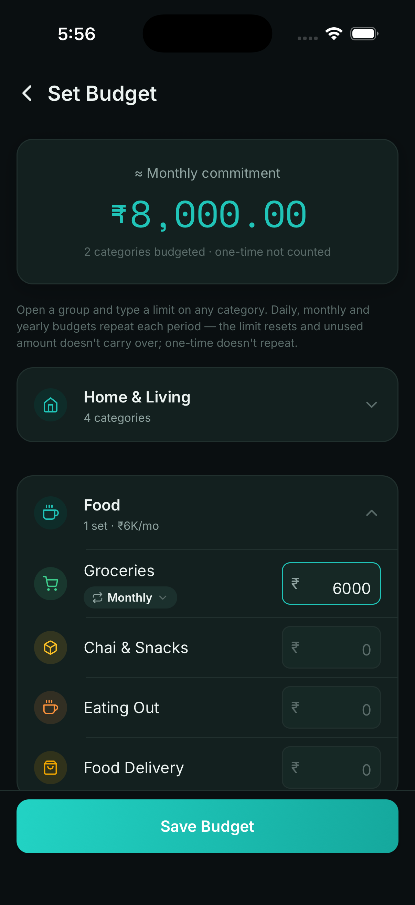

**Scenarios tested:** typed a real category limit (Chai & Snacks → ₹2000).

**What's good:** excellent live reactivity — "Monthly commitment" total, category count, and the parent group's "N set" summary all update instantly as you type, with no separate save step needed to see the effect. A cadence selector ("Monthly") auto-appears once a category gets a value. No friction found here.

### Group Members (`group/[id]/members.tsx`)

**Scenarios tested:** tapped the edit pencil on a real contact (Aarav) → "Rename" bottom sheet opened correctly, pre-filled, with Save.

**What's good:** clean per-member owed/owes breakdown, working rename sheet, "Add or create person" affordance. No friction found.

### Group Recurring (`group/[id]/recurring.tsx`)
 

**Scenarios tested:** tapped Pause on an active rule → state cleanly flipped to "Paused" with a "Paused [date]" field replacing "Next," and action buttons swapped to Resume/Stop.

**What's good:** correct, immediate state transition with no ambiguity about what changed. No friction found.

### Group Edit (`group/[id]/edit.tsx`)
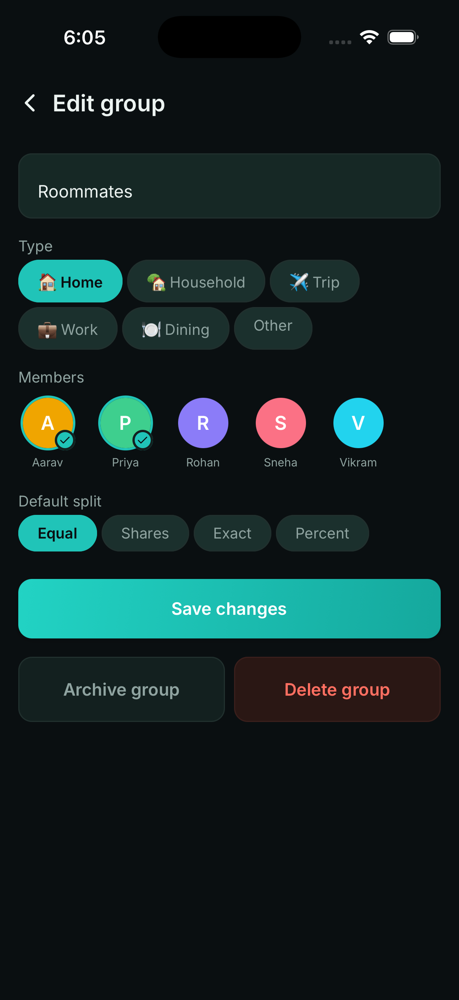

**Scenarios tested:** switched the group Type chip (Home → Trip), toggled a member checkbox on/off.

**What's good:** both interactions work correctly and give immediate visual feedback (chip highlight moves, checkmark badge toggles).

**Friction found:** the member avatar row's tappable area appears **wider than the visible circle** — a tap in the visual gap between two avatars registered against the nearer avatar rather than doing nothing. This isn't necessarily wrong (generous hit targets are good per AGENTS.md §6), but worth confirming the hit areas don't overlap each other, which could cause a tap intended for one member to silently toggle their neighbor instead.

### Personal (`personal.tsx`)
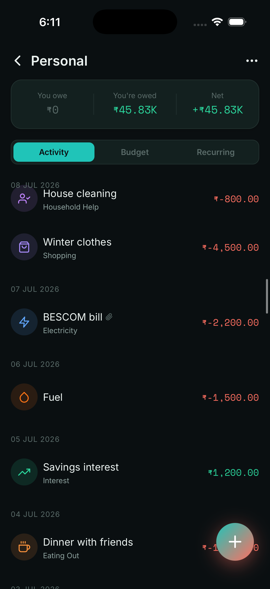

**Scenarios tested:** scrolled the Activity feed.

**Friction found:** **same FAB-overlap pattern, 4th confirmed instance** — scrolling reveals the "+" FAB sitting on top of the last visible transaction row's amount.

### Goal detail (`savings/[id].tsx`)
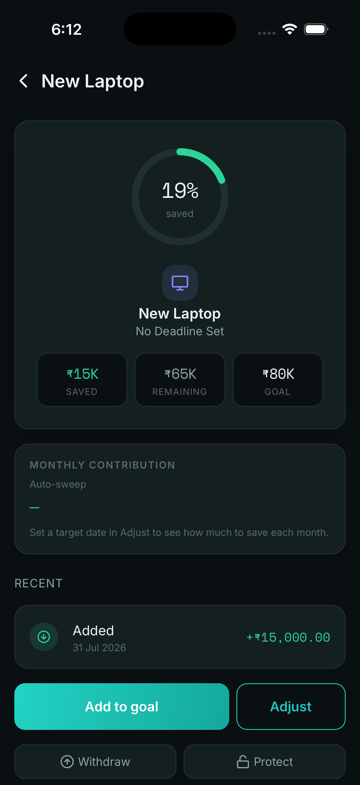

**Scenarios tested:** tapped "Add to goal" → "Add funds" bottom sheet opened correctly with amount entry and "₹85.41K cash available · comes out of your Cash available" context line.

**What's good:** the sheet clearly states where the money is coming from before you commit — prevents a confusing balance change later. No friction found.

### Transaction detail (`txn/[id].tsx`)
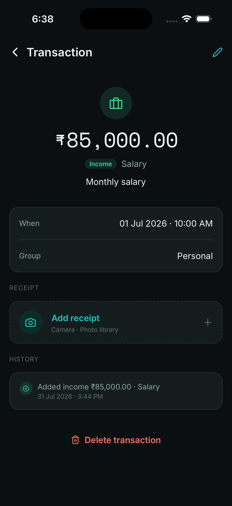

**What's good:** clean, no FAB on this screen (correctly — it's a detail/actions view, not a list), full history trail ("Added income ₹85,000.00 · Salary"), receipt attach affordance, delete action clearly separated at the bottom. No friction found.

### Category detail (`category/[name].tsx`)
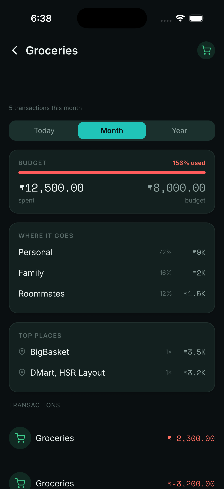

**What's good:** budget-vs-spent bar with % used, per-group breakdown ("Where it goes"), "Top places," and a transaction list all in one coherent view. No FAB (correct — read-only analytics screen). No friction found.

### Plan → Recurring (`plan/recurring.tsx`)
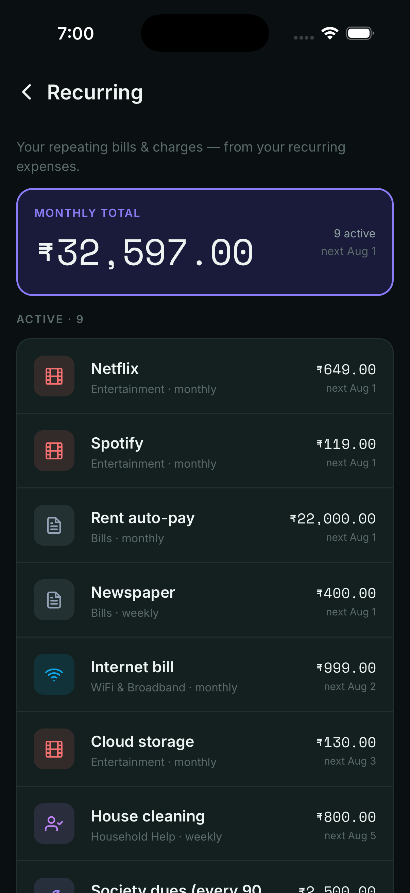

**What's good:** monthly total hero, active count + next charge date, and a clean per-item list (name, category, cadence, amount, next date). No FAB (correct). No friction found.

## Tier 3 — Settings & utility

### Settings main (`(tabs)/settings.tsx`)
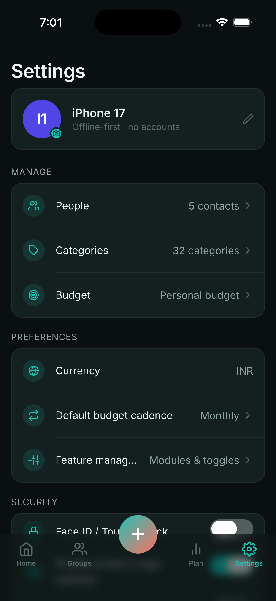 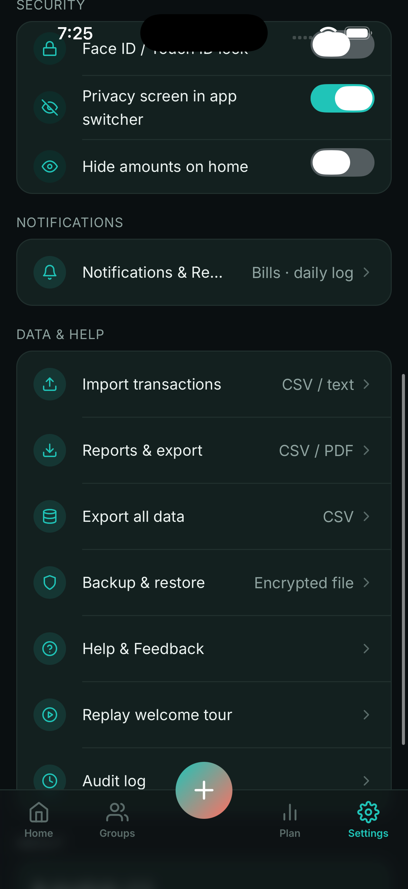

**Scenarios tested:** scrolled to the bottom; re-screenshotted twice to rule out a capture artifact.

**What's good:** clear sectioning (Manage/Preferences/Security/Notifications/Data & Help), every row shows its current value inline (no need to open a row just to check a setting).

**Friction found:**
- **Confirmed real bug (verified twice, not a capture glitch):** when scrolled, list content renders **underneath the iOS status bar** — the status bar's time readout visibly overlaps the "Face ID / Touch ID lock" row text. The screen likely lacks a persistent header or top safe-area reservation once its large title scrolls away.
- **Text truncation, 2 instances**: "Feature manag..." and "Notifications & Re..." both clip mid-word because the value text ("Modules & toggles", "Bills · daily log") claims too much of the row's width. Minor individually, but a repeating pattern worth a general fix (e.g. let the label wrap, or shorten the value text).
- **5th–6th confirmed instance of the FAB-overlap issue** — the FAB sits on top of the Face ID row (first scroll) and the Audit log row (further scroll). At this point the pattern is confirmed on essentially every scrollable screen with a FAB.

### Friends / People (`friends.tsx`)
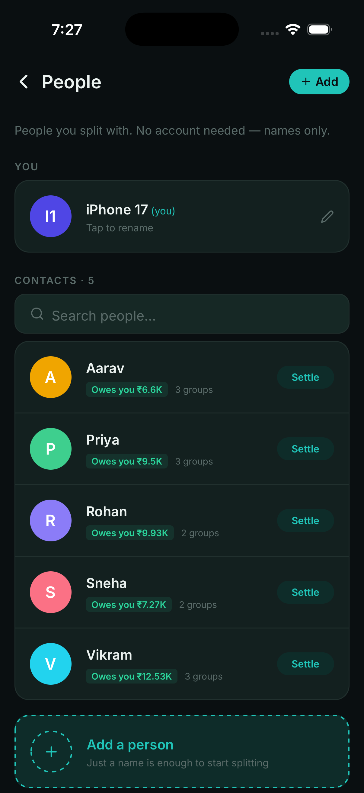

**What's good:** no FAB-overlap issue here — this screen correctly uses a top-right "+ Add" button plus a dashed "Add a person" card at the bottom instead of a floating action button, so nothing gets covered. Clear per-person owed amounts + group count + a "Settle" shortcut right on the row. This is a good pattern the FAB-based screens could learn from.

### Categories (`categories.tsx`)
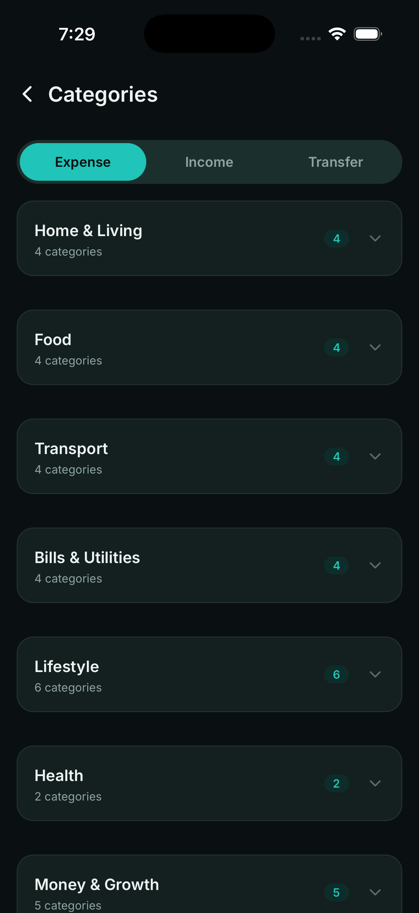 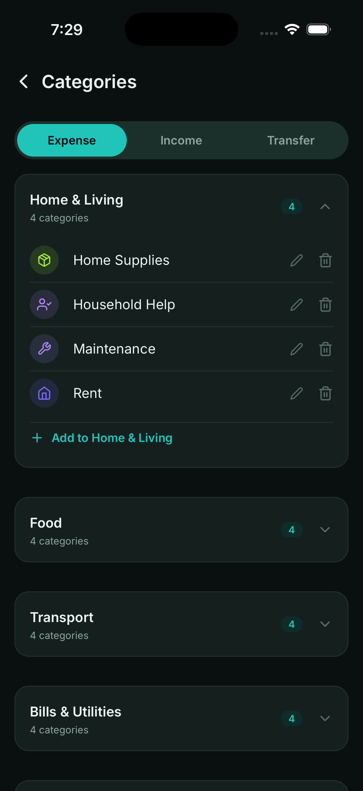

**Scenarios tested:** expanded a category group (Home & Living) via real tap.

**What's good:** clean expand/collapse, inline edit/delete icons per category, "Add to [group]" CTA — no FAB needed since the add action is already inline. No friction found.

### Feature Management (`features.tsx`)
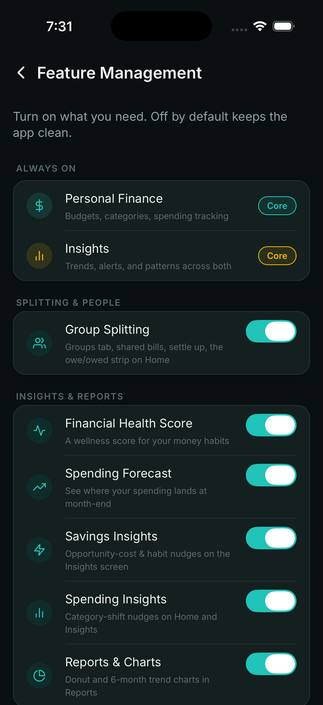

**What's good:** clear grouping (Always On / Splitting & People / Insights & Reports), each toggle has a one-line description of exactly what it affects — no guessing what a flag does. No friction found.

### Help & Guide (`help.tsx`)
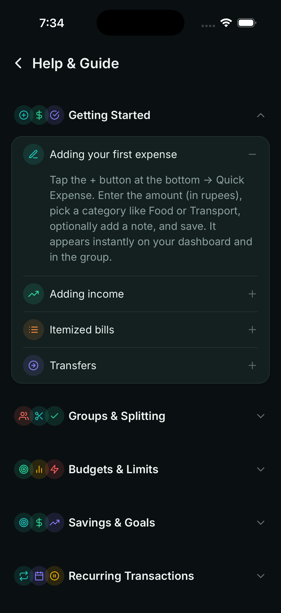

**What's good:** progressive-disclosure sections (first one open by default), concrete step-by-step copy ("Tap the + button at the bottom → Quick Expense..."). No friction found.

### Audit log (`history.tsx`)
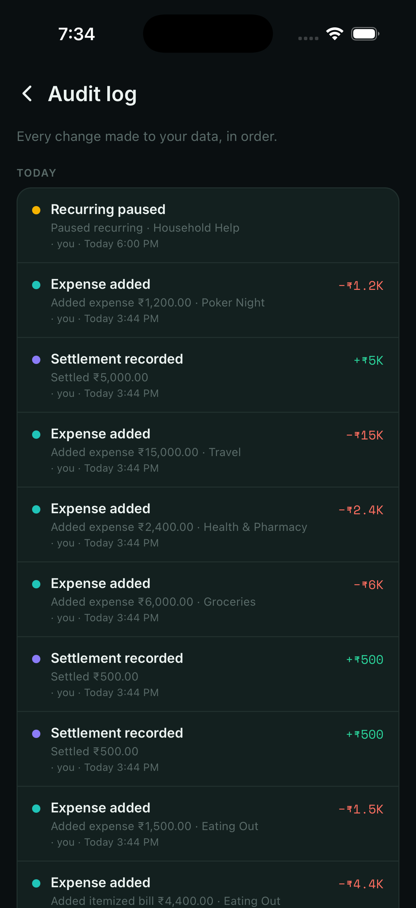

**What's good:** color-coded event dots, every change timestamped and amount-annotated, genuinely useful as a real audit trail (it correctly logged every test action taken during this audit — recurring pause, expense adds, settlements). No friction found.

### Search (`search.tsx`)
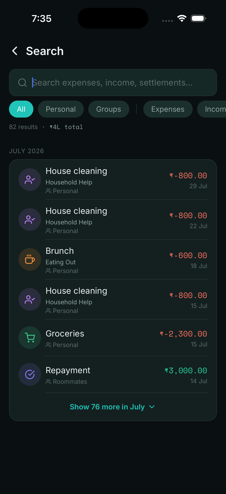 

**Scenarios tested:** typed a query with no matches.

**What's good:** proper empty state on no-match (icon + "No matches" + "Try a different word or amount" — follows AGENTS.md §2's empty-state structure exactly). Filter chip row (All/Personal/Groups/Expenses/Income...) is a nice one-screen filter model.

**Friction found:** the filter chip row is wider than the screen and the last chip ("Income") is clipped at the edge with no visible scroll affordance (no fade gradient, no partial-next-chip peek beyond the hard cut) — a user could miss that the row scrolls horizontally at all.

### Backup & Restore (`settings/backup.tsx`)
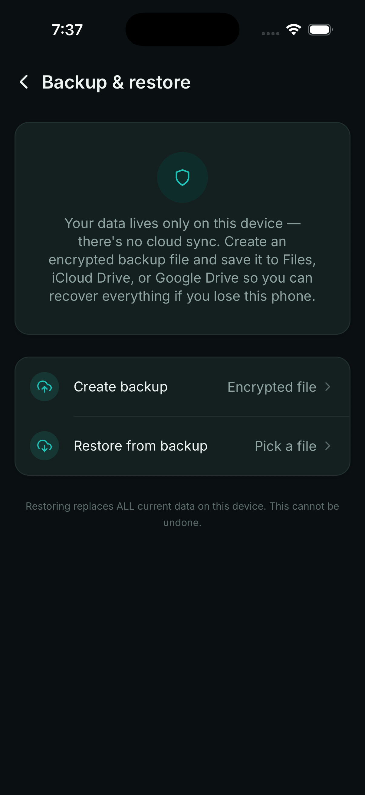

**What's good:** the risk of restoring is stated plainly and prominently ("Restoring replaces ALL current data on this device. This cannot be undone.") right where the action lives, not buried in a tooltip. No friction found. (Did not execute a real create/restore — out of scope to avoid touching real file-system state during an audit.)

### Notifications & Reminders (`settings/notifications.tsx`)
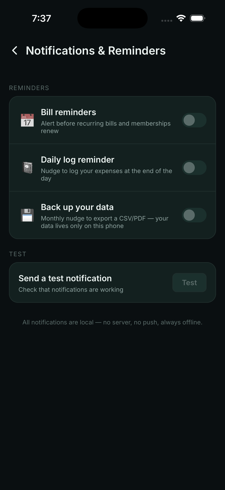

**What's good:** all three reminder types explain exactly what they do and when, plus a reassuring "All notifications are local — no server, no push, always offline" footer. No friction found.

*(`storage.tsx` was used earlier purely as the demo-data-seeding utility, not audited as a user-facing screen — it's an intentionally hidden dev/QA tool, 7-tap gated, out of scope for UX judgment.)*

## Tier 4 — Optional / power-user modules

### Can I afford this? (`afford.tsx`)
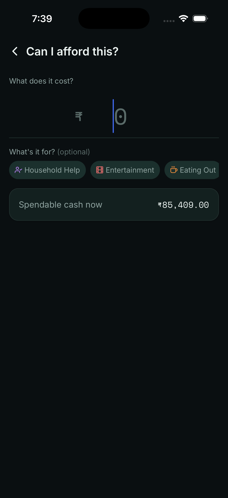 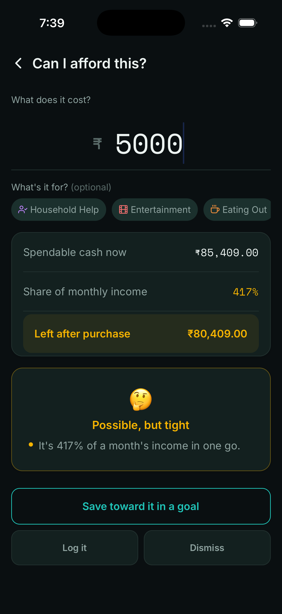

**Scenarios tested:** typed a real amount (₹5,000) against a demo salary of ₹85,000/month.

**What's good:** the concept — check affordability against real cash + income before spending — is genuinely useful, and the result card format (verdict + reasoning + 3 concrete next actions: Save toward goal / Log it / Dismiss) is well designed.

**Friction found — major, high-confidence bug**: "Share of monthly income" showed **417%** for a ₹5,000 purchase against ~₹85,000/month income (correct value: ~6%). Off by roughly 70–80x — strongly suggestive of a paise/rupee unit-conversion bug in this specific calculation (money elsewhere in the app is stored as integer paise per `AGENTS.md` §Code Quality Rules; this screen may be comparing a rupee amount against a paise-denominated income figure, or vice versa). The verdict copy ("Possible, but tight") also doesn't match what a real 417% figure would mean (that should read as flatly impossible), which is itself a tell that the number is wrong rather than the message being wrong.

### Insights (`insights.tsx`)
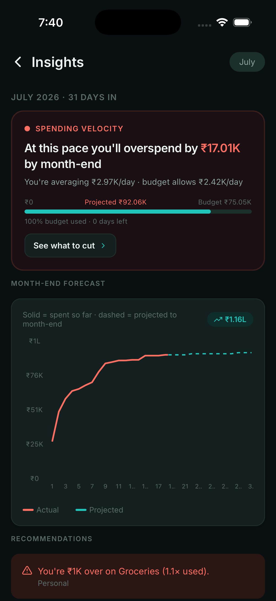

**What's good:** "Spending velocity" framing (₹/day pace vs. budget-allowed ₹/day, translated into a month-end overspend estimate) is a genuinely sharp, actionable insight — better than a static budget bar. The Actual/Projected month-end forecast chart with a "See what to cut" CTA is well-built.

**Friction found:** the forecast chart's x-axis day labels are truncated to unreadable fragments ("1..", "1..", "2..", "3.") — the chart has room for full 2-digit day numbers; this needs either fewer tick labels or smaller/rotated text, not a hard character clip.

### Reports (`reports.tsx`)
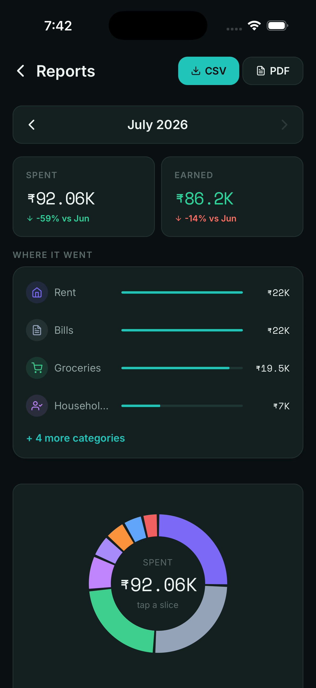 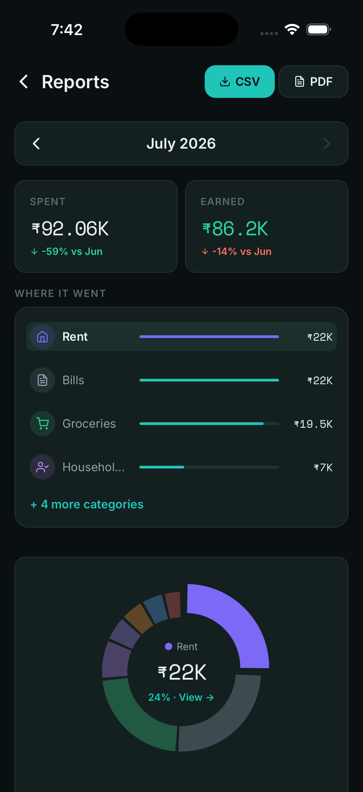

**Scenarios tested:** tapped a donut slice (Rent) to test list↔chart sync.

**What's good:** donut/list selection sync works correctly and instantly (tapping "Rent" highlights the list row and shows "Rent · ₹22K · 24% · View →" in the donut's center) — matches the two-way `selectedName` sync described in project history. The month-over-month delta coloring is semantically correct: spending down = green (good), earning down = red (bad) — not just "down is always X color."

**Friction found:** another (4th) instance of the category-label truncation pattern — "Househol..." for Household Help.

### Reminders (`reminders.tsx`)
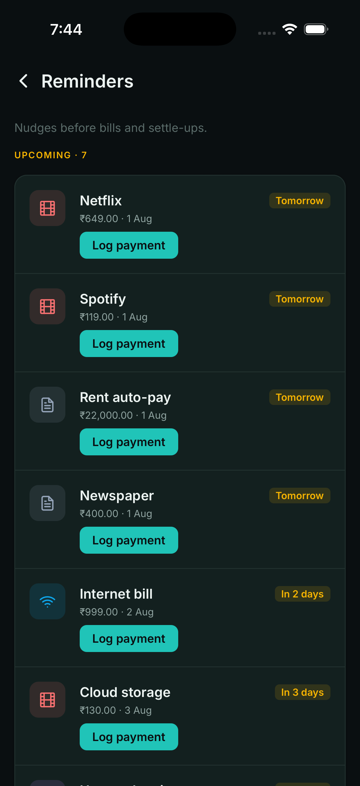

**What's good:** clean list, per-item "Log payment" CTA right where you'd act on it, clear "Tomorrow / In 2 days / In 3 days" urgency labels. No FAB (correct — no generic "add" action belongs here). No friction found.

### Import (`import.tsx`)
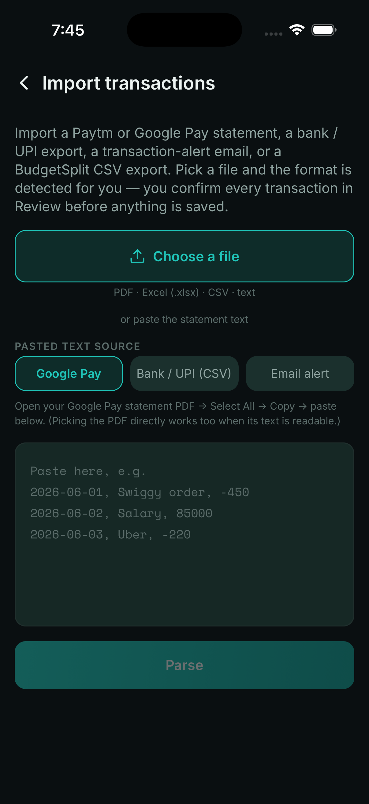

**What's good:** the instructional copy is concrete and step-by-step ("Open your Google Pay statement PDF → Select All → Copy → paste below"), with a realistic placeholder example in the paste box. "Parse" correctly stays disabled until there's something to parse. No friction found. (Did not exercise the native file-picker — out of scope for a simulator audit.)

### Review inbox (`review.tsx`, 977 LOC — largest screen)
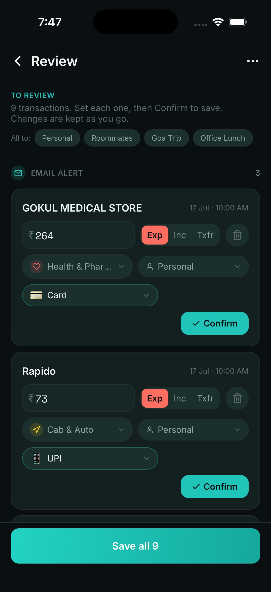 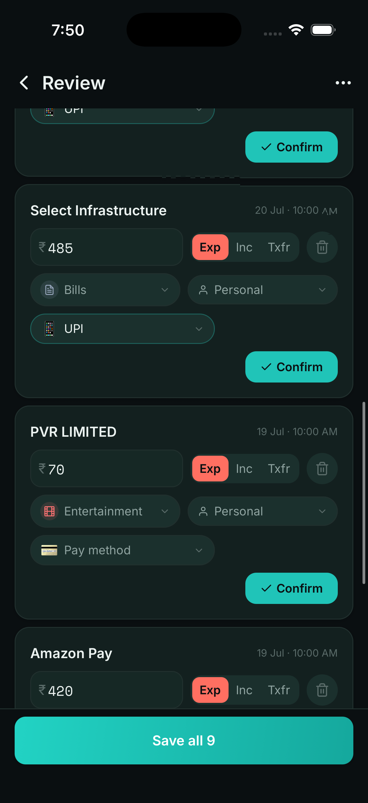

**Scenarios tested:** tapped Confirm on a pending row, scrolled through multiple sourced sections.

**What's good:** sectioning by source (Email alert, GPay, etc.) with per-row kind toggle (Exp/Inc/Txfr), category, group, and pay-method all editable inline, plus a bulk "Save all N" action — a lot of editing power without leaving the screen. "All to: Personal/Roommates/..." bulk-group-assign chips are a nice touch for reviewing many rows at once.

**Friction found / unclear:**
- Tapping "Confirm" on a row didn't produce any visible change in this pass (row stayed exactly as-is) — this may be correct behavior per the screen's own copy ("Changes are kept as you go," implying Confirm just locks in values without removing the row until "Save all"), or may be a real no-op bug. Not confident enough to log as a firm bug — needs a real device check specifically watching for a confirmed-state visual cue (checkmark, dimming, etc.).
- One pending row shows "Select Infrastructure" as the merchant name — an odd, non-human-sounding string. Could be a real payment-aggregator name that legitimately appears in bank/UPI statements (the seed data intentionally includes messy real-world cases), so **not logged as a bug**, just flagged in case it's actually a parse failure leaking raw text into the merchant field.

## Tier 0 — First-run onboarding (`src/components/system/Onboarding.tsx`)

Walked the entire real flow end-to-end with real taps and typing (not just deep-linked past it): Welcome → persona picker → 3-card feature carousel (Know where it goes / Split, minus the math / Yours alone) → name entry → 5-step setup questionnaire (income → cash & investments → monthly budget → people you split with → notification/location permissions) → lands on Home with everything applied.

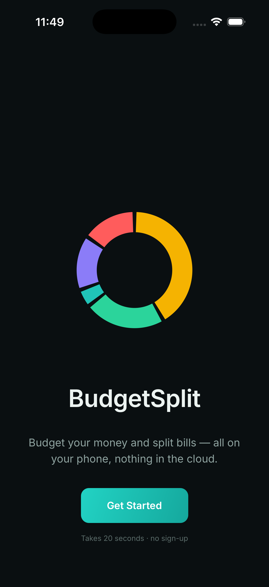 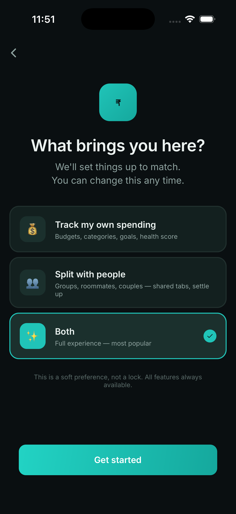 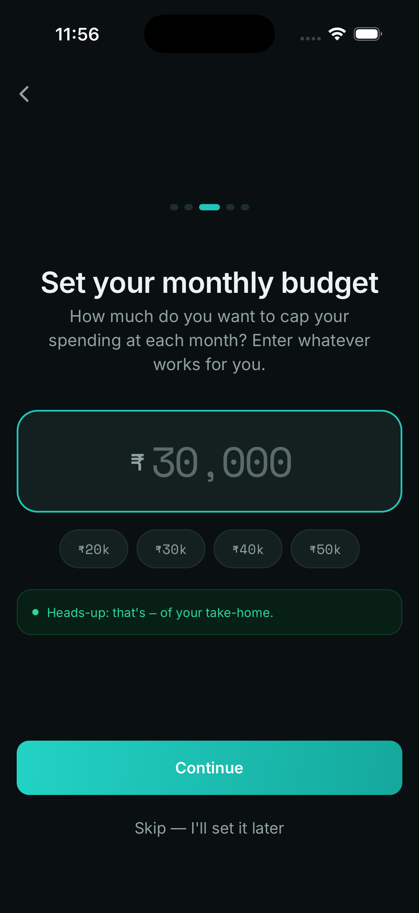 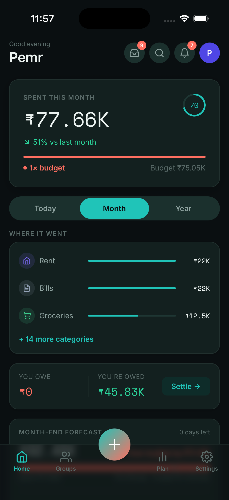

**Scenarios tested:** real taps through all ~9 screens, typed a name and an income value, selected quick-pick chips, completed the full questionnaire, landed on Home and confirmed the entered values actually took effect (name showed in the greeting, income/budget reflected).

**What's good:**
- Genuinely fast — every step has a sensible prefilled default and a "Skip" escape hatch, matching the "Takes 20 seconds · no sign-up" promise on the welcome screen.
- Local-first/offline privacy story is repeated at the right moments ("Yours alone — no account, no cloud, no tracking," permissions step says "Both are optional and fully on-device") — builds trust exactly where a user would be wary.
- The 5-step questionnaire (progress dots) correctly carries every entered value through to the real app state — confirmed on Home after finishing.
- The persona picker ("Track my own spending" / "Split with people" / "Both") is a known, already-tracked gap, not a new finding: per [[project_onboarding_persona_flags]] and the competitive analysis doc, there's no distinct "couple/household" persona yet — this audit just reconfirms it's still the case.

**Friction found — confirmed bug**: the monthly-budget step shows **"Heads-up: that's – of your take-home."** — a bare em-dash where a computed percentage should be (e.g. "that's 100% of your take-home" for a ₹30,000 budget against ₹30,000 income). This is the **second instance** of the exact same failure class as the itemized wizard's "Must f.total" bug — a template value not resolving and leaking a placeholder character straight to the user. Both should likely be fixed together since they may share a root cause (a formatting/interpolation helper that fails silently instead of computing a real number).

## Round 2 addendum — partial deeper-state coverage (2026-08-01)

Before this round was paused (to control cost/time), the following additional ground was covered:

- **Group hub across 4 of 7 groups** (Personal, Goa Trip, Office Lunch, Family), confirming the template holds up well across very different states:
  - **Personal's group view** is effectively the same screen/data as the already-audited `personal.tsx` (same filter chips, same FAB overlap issue — 7th confirmed instance).
  - **Goa Trip** (non-netted debts): correctly shows per-transaction "borrowed ₹X" / "lent ₹X" instead of one net figure — the `simplify_debt: off` behavior renders as intended.
  - **Office Lunch** (fully settled): the "You owe / You're owed" hero card is **omitted entirely** rather than showing an explicit "All settled up" state — works, but a missed opportunity for positive confirmation (AGENTS.md §2's empty-state philosophy — never just absence, always explicit feedback — arguably applies here too).
  - **Family** (you-owe direction): hero card correctly switches to a red/dark treatment for "YOU OWE" vs. the green "YOU'RE OWED" elsewhere — good semantic consistency.
- **In-hub tabs are genuinely distinct from the standalone routes, not duplicates** — this was an open question from round 1, now resolved. The in-hub **Budget** tab (inside `group/[id].tsx`) adds a **"Who paid what" fairness breakdown** per member (ahead/behind their fair share) that the standalone `group/[id]/budget.tsx` route never shows. This is a real, valuable distinction worth documenting in `FEATURES_AND_FLOWS.md` if it isn't already clear there.

**Not yet covered from the round 2 list** (stopped here by user request to manage cost): remaining 3 group states (Weekend Plans/empty, Old Flat/archived, and a full look at the in-hub Recurring/Members tabs), all 8 goal states, the Settle Up flow, category/date/split-editor pickers, the receipt/OCR scan flow, `report-transactions.tsx`, the other 2 onboarding personas, transaction-detail variants beyond income, category-detail variants beyond Groceries, and the Review inbox kebab menu. These remain open if you want to resume later — flagging them here so nothing is silently dropped.

## Final rolled-up priority list

18 raw observations across the audit collapse into **13 distinct issues** once duplicates (the FAB overlap seen 6 times, the truncation pattern seen 4 times) are merged. Sorted by priority.

### High — confirmed bugs, fix first

| # | Finding | Where seen | Why it matters |
|---|---|---|---|
| 1 | Two broken template strings leak raw placeholders to the user: **"Who paid? Must f.total ₹X"** (itemized wizard step 3) and **"that's – of your take-home"** (onboarding budget step) | Itemized wizard, Onboarding | Visible on essentially every itemized expense and every fresh install. Same failure class (a value/percentage helper not resolving) — worth investigating together, possibly one root cause. |
| 2 | **"Share of monthly income" miscalculated** — showed 417% for a ₹5,000 spend against ₹85,000/month income (correct: ~6%), off by ~70–80x, consistent with a paise/rupee unit bug | Can I afford this? (`afford.tsx`) | Directly contradicts the feature's purpose (giving an honest affordability read) and could give a genuinely wrong "possible" vs. "impossible" verdict on real money decisions. |
| 3 | **FAB (floating "+" button) overlaps real list content** with no reserved bottom padding — confirmed on 6 separate screens/scroll-positions: Group hub, Plan tab, Personal (x2), Settings main (x2) | App-wide, any scrollable screen with the FAB | Systemic — hides real data (amounts, progress bars, settings rows) on what is likely the single most-used UI element in the app. |
| 4 | **Settings content scrolls underneath the iOS status bar** — the status bar clock overlaps the "Face ID / Touch ID lock" row text (verified twice, not a capture glitch) | Settings main | A real, visible layout bug on a core settings screen. |

### Medium — real friction, worth fixing

| # | Finding | Where seen |
|---|---|---|
| 5 | **Row/label text truncates mid-word**, confirmed 4 times: "Feature manag...", "Notifications & Re..." (Settings), "Household Help" → "Househol..." (Reports, Search filter row) | Settings main, Reports |
| 6 | **Inconsistent tap affordance** — some Groups-list cards show a `›` chevron, others (equally tappable) don't | Groups list |
| 7 | **Same red used for two different meanings** — "over budget" (bar) and "you owe money" (pill text) are visually identical despite meaning different things | Home, Groups list |
| 8 | **Chart x-axis labels truncated to unreadable fragments** ("1..", "2..", "3.") on the month-end forecast chart | Insights |
| 9 | **Home's icon row measured at 36×36pt** (not just eyeballed) — under AGENTS.md's own 44×44pt touch-target minimum; may already be mitigated by `hitSlop` but worth confirming given how tightly packed the three icons are | Home |
| 10 | **Filter-chip row is clipped** at the screen edge with no visible scroll affordance (no fade, no partial next-chip peek) | Search |
| 11 | **Member avatar tap zones may extend past the visible circle into gaps between avatars** — one tap intended to land in empty space instead toggled the nearer avatar | Group Edit |
| 12 | **Fully-settled group hides its owed/owe hero card entirely** instead of showing an explicit "All settled up" confirmation | Group hub (Office Lunch) |

### Low / unconfirmed — flagged for a real-device recheck, not blocking

| # | Finding | Where seen |
|---|---|---|
| 12 | Possible keyboard-dismiss-eats-first-tap after typing into a field, then tapping a primary CTA — observed once, contradicted by a similar case elsewhere in the same flow that worked first-try | Itemized wizard |
| 13 | Review inbox's "Confirm" tap produced no visible state change — may be correct behavior (values lock in silently until "Save all") rather than a bug | Review inbox |

### Explicitly NOT bugs (checked and ruled out)
- Home's "Month-end forecast" looked cut off in a static screenshot but is fully present and well-built once scrolled — a testing artifact of the pre-real-tap phase, not an app issue.
- Quick Add's apparently-empty lower half was captured before real-tap tooling existed; needs a fresh look but isn't asserted as a bug.
- The onboarding persona picker lacking a distinct "couple/household" option is a known, already-tracked product gap (see [[project_onboarding_persona_flags]] and the competitive-analysis doc), not a new finding.
- Deep-linking directly into the itemized wizard breaks its back button (`GO_BACK` not handled) — purely a side effect of this audit's navigation method (no prior screen in the stack); real users always arrive here via a normal push and are unaffected.
- Reports' month-over-month percentage coloring (spend down = green, earn down = red) is semantically correct, not a bug.
- "Select Infrastructure" as a merchant name in the Review inbox is plausibly a real payment-aggregator name from a real bank statement (the seed data intentionally includes messy real-world cases), not necessarily a parse failure.

## Summary

Across ~30 screens, real taps/scrolls/typed input (not just static screenshots) surfaced **2 confirmed money-math/string bugs**, **1 systemic layout bug** (FAB overlap, 6 instances), **1 confirmed status-bar overlap bug**, and a handful of smaller consistency issues (truncation, chevron affordance, color reuse, touch targets). The app's core interaction design is fundamentally sound — most screens showed no friction at all, live-reactivity (budget editor, chip selection, donut/list sync) works correctly, and empty/error states consistently follow the app's own design rules. The bugs found are narrow and fixable, not signs of a deeper architectural problem.

**Recommended next step**: review this list with the user, prioritize the 4 High items first (both broken strings likely share a root cause worth investigating together; the FAB overlap is the single highest-value fix given its 6-screen reach), then decide on Medium items as a batch. Implementation is a separate, deliberately-not-yet-started phase per the project's usual cadence.

